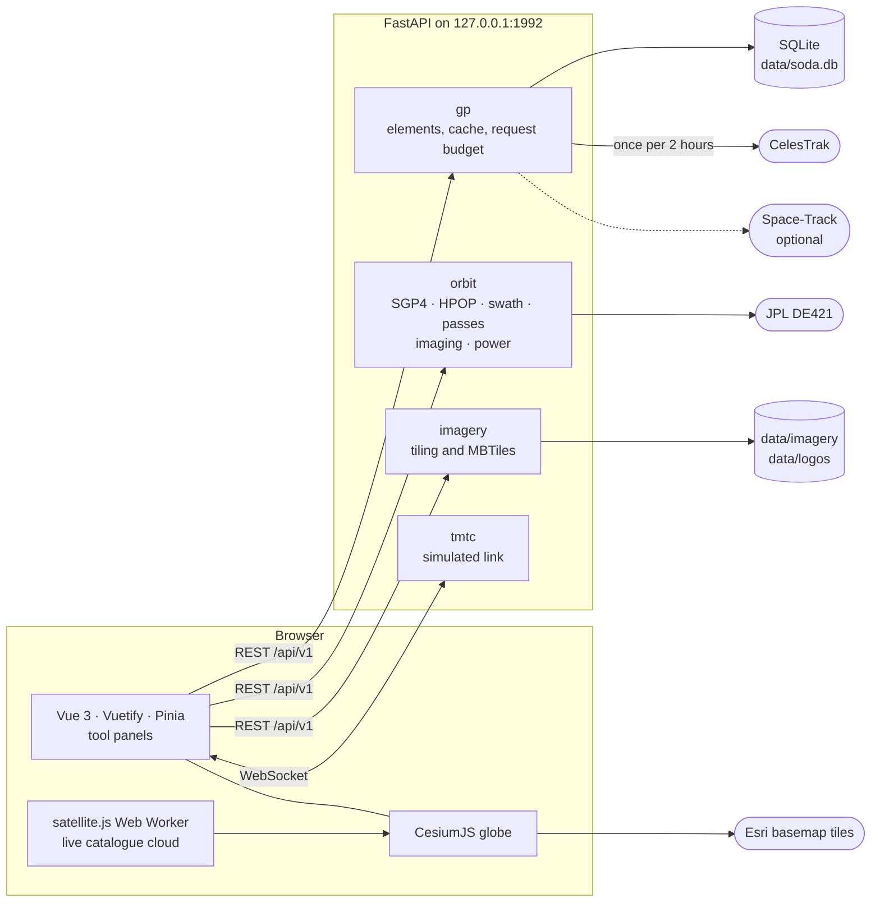

<div align="center">

<picture>
  <source media="(prefers-color-scheme: dark)" srcset="docs/images/soda-primary-dark.png">
  
</picture>

# SODA

**3D 지구본에서 궤도를 전파하고, 관측폭을 보고, 패스를 계획하는 로컬 도구.**

[](https://github.com/messy-snail/SODA/actions/workflows/ci.yml)
[](LICENSE)
[](https://www.python.org/)
[](https://nodejs.org/)


[English](README.md) · **한국어**

</div>

<p align="center">
  
</p>
<p align="center"><sub>배경 영상 © Esri, Maxar, Earthstar Geographics, and the GIS User Community</sub></p>

> [!NOTE]
> **출처.** SODA는 [OrbitView](https://github.com/SpaceEngineerSS/OrbitView)(MIT)의
> 구조를 참고하고 일부 로직을 옮겨 왔다. 나머지는 Vue 3·Vuetify·CesiumJS 프런트엔드와
> FastAPI·Skyfield 백엔드로 새로 만들었다.
> [THIRD_PARTY_NOTICES.md](THIRD_PARTY_NOTICES.md)를 본다.

**S**atellite **O**rbit **D**ynamics & **A**nalysis는 임무 분석용 로컬 웹 도구다.
`127.0.0.1`에서 돌고, 계정도 지도 토큰도 필요 없으며, 데이터는 SQLite 파일 하나에 둔다.
화면은 한국어와 영어를 지원하고 시간은 모두 UTC다.

**목차:** [둘러보기](#둘러보기) · [설치](#설치) · [빠른 시작](#빠른-시작) ·
[동작 구조](#동작-구조) · [참고](#참고) · [개발](#개발) · [라이선스](#라이선스)

화면 영상은 영어 UI로 찍었다. 앱바의 언어 버튼으로 한국어로 바꿀 수 있다.

## 둘러보기

### 🛰️ 궤도 전파

<p align="center">
  
</p>

카탈로그를 이름이나 NORAD 번호로 검색해 위성을 8개까지 모으고 한 번에 전파한다. 전파
결과마다 기간 전체의 고도와 베타각 그래프를 보여 주고, 시점은 지구고정(ECEF)과
관성(ECI) 사이에서 바꾼다.

- **SGP4**, 또는 **HPOP** 수치 적분: EGM96 중력장 최대 20×20, 해·달 중력,
  Harris-Priester 대기 항력, 태양복사압.
- **내 궤도**: TLE 목록과 OMM(JSON·XML·KVN·CSV), CCSDS OPM 상태벡터, OEM ephemeris를
  붙여 넣거나 파일로 가져온다.
- CelesTrak 궤도요소는 자동으로 갱신되고 Space-Track 이력은 선택이다.

> [!IMPORTANT]
> TLE·OMM에서 시작한 HPOP은 그 궤도요소의 오차를 그대로 이어받는다. 섭동력을 비교하는
> 용도이지 SGP4보다 정확한 궤도가 아니다.

### 📡 관측폭과 Field of Regard

<p align="center">
  
</p>

전파 결과에 관측폭을 켜면 nadir 관측폭, 기울임 한계 안의 관측 가능 폭, 센서
footprint를 WGS84 타원체에서 계산해 그린다. 주간 필터는 subpoint의 태양고도가 충분한
구간만 남긴다.

센서 프리셋은 기관 공표 스펙이 아니라 예시값이다. 실제 분석에는 관측폭·최대
기울임·최소 태양고도를 직접 넣는다.
[`frontend/src/sensors/SOURCES.md`](frontend/src/sensors/SOURCES.md)를 본다.

### 🗼 패스 예측

<p align="center">
  
</p>

한 번의 계산이 전파한 위성 전부와 지상국 8곳까지를 다룬다. AOS·TCA·LOS, 최대 고도각,
가시권 외곽선을 보여 준다. 두 위성이 같은 지상국을 동시에 원하면 우선순위가 높은 쪽이
가져간다. 패스를 열면 스카이 플롯과 고도각·거리·거리 변화율·도플러 곡선이 나온다.

- 공표된 지상국 43곳(NASA DSN·NSN, ESA ESTRACK, KSAT, JAXA, ISRO, CNES, KARI 등)에서
  고르거나 좌표를 직접 넣는다. 좌표마다 인용 가능한 출처가
  [`frontend/src/stations/SOURCES.md`](frontend/src/stations/SOURCES.md)에 있다.
- 좌표는 시설 기준점이지 안테나 위상중심이 아니다. 최소 고도각은 기관 공표값이 아니라
  망별 관례다.
- 방위각 마스크는 `(방위각, 최소 고도각)` 쌍으로 넣는다. 마스크에 걸려 끊기는 패스는
  교신 구간 둘로 나뉜다.

### 🎯 촬영 계획

<p align="center">
  
</p>

지구본을 클릭해 점을 찍거나 영역을 그린 뒤, 롤·피치 한계와 최소 태양고도 안에서 각
위성이 언제 찍을 수 있는지 찾는다. 촬영 기회마다 시각, off-nadir 각, 촬영 비율이
나오고, 누르면 시계가 그 시각으로 가면서 촬영 띠와 시선이 그려진다.

### 🔋 저장량과 전력

<p align="center">
  
</p>

두 도구 모두 위성 하나의 촬영 계획과 배정된 패스로 계산한다.

- **저장량**은 영상 파일 단위 레코더다. 촬영 창 하나가 파일 하나이고, 지상국마다 정한
  밴드와 속도로 교신 중에 내려보낸다. 최대 점유율, 손실, 지상까지의 지연시간을 낸다.
- **전력**은 등가회로 배터리로 식(eclipse)을 거치는 에너지 수지를 적분해 최저 SOC와
  최대 DOD를 낸다.

모델과 한계는 [docs/architecture.md](docs/architecture.md)에 있다.

### 📟 TC/TM 모의 링크

<p align="center">
  
</p>

모의 위성이 교신 중에 지상과 CCSDS 패킷을 주고받는다. 시뮬레이션 시계를 따르며, 교신
밖에서 보낸 명령은 다음 AOS를 기다리고 저장된 텔레메트리는 링크가 열리면 재생된다.
SODA 안에서만 동작하고 실제 시스템과 연결하지 않는다. [docs/tmtc.md](docs/tmtc.md)를 본다.

### 🗺️ 사용자 영상

<p align="center">
  
</p>
<p align="center"><sub>시연용 영상: Satellogic EarthView에서 만든 것, CC BY 4.0</sub></p>

MBTiles, GeoTIFF·COG, 또는 네 모서리 좌표를 준 이미지를 등록한다. 서버가 Web Mercator
타일로 자르고, 카메라가 그곳으로 이동하며, 그 위로 확대해 있으면 배경 지도 위에 영상이
나타난다. 큰 파일은 `data/imagery/inbox`에 넣어 두면 된다.

<p align="center">
  
</p>
<p align="center"><sub>샘플 영상: Satellogic EarthView, Umbra Open Data Program, CC BY 4.0</sub></p>

세트마다 센서 종류와 해상도가 보이고, 버튼 하나로 그 위치로 이동한다. 공개 카탈로그
탭은 지금 보는 지역을 Maxar Open Data(CC BY-NC 4.0, 비상업 용도만)와 OpenAerialMap에서
검색한다. 로그인이나 주문이 필요한 영상은 SODA가 대신 받아 오지 않는다.

전체 설명은 [docs/imagery.md](docs/imagery.md)에 있다.

### 🌗 2D 지도, 낮과 밤, 식

<p align="center">
  
</p>

지구본과 2D 지도를 언제든 바꾼다. 밤과 위성의 식 구간은 지도에 음영으로, 궤도선에는
어둡게, 시계 띠에는 표시로 나온다. 장소 검색, 핀, 국경, 레이어 스위치는 **보기** 도구에
있다.

### 🗄️ 데이터베이스와 설정

<p align="center">
  
</p>

SODA가 저장하는 것은 SQLite 파일 하나다. 설정 창은 그 파일이 어디 있고 무엇이 들어
있는지 보여 주고, 새 경로로 바꾸기 전에 연결을 테스트하며, 테이블마다 원본 행을 넘겨
볼 수 있게 한다. 지상국·센서 프리셋·사용자 궤도요소는 JSON으로 내보내고 다시 가져올 수
있고, DB 파일 자체도 내려받을 수 있다.

## 설치

Python 3.12 이상, [uv](https://docs.astral.sh/uv/), Node.js 22 이상이 필요하다.
pnpm은 `npx`로 실행하므로 따로 설치하지 않는다.

```bash
git clone https://github.com/messy-snail/SODA
cd SODA
uv sync
npx --yes pnpm@10.34.5 --dir frontend install --frozen-lockfile
npx --yes pnpm@10.34.5 --dir frontend build
```

> [!TIP]
> 샘플 영상(고해상도 광학·SAR, 약 600 MB)은 별도 저장소에 있고 선택 사항이다.
> `git submodule update --init samples`로 받는다. 일부는 비상업 용도만 허용한다.
> `samples/SOURCES.md`를 본다.

## 빠른 시작

```bash
uv run soda serve            # API와 화면: http://127.0.0.1:1992
uv run soda serve --port 2000
uv run soda refresh          # 궤도요소 수동 갱신 (2시간에 한 번 규칙은 그대로)
```

브라우저에서 <http://127.0.0.1:1992>을 연다.

1. **궤도** - 위성을 고르고 기간을 정해 `전파 실행`을 누른다.
2. **관측폭** - `관측폭 그리기`를 켜고 관측폭·기울임·태양고도를 정한다.
3. **패스** - 지상국을 고르고 `패스 계산`을 누른다.
4. **촬영** - 지구본을 클릭해 표적을 넣고, 전파한 위성 전부의 촬영 기회를 계산한다.
5. **저장량·전력·TC/TM**은 위성 하나를 다룬다. 패널 위에서 대상 위성을 고른다.

첫 실행 때 CelesTrak `active` 그룹을 받는다. swath나 패스를 처음 요청하면 JPL DE421
천체력(약 17 MB)을 `data/ephemeris/`에 내려받는다.

## 동작 구조



- 숫자로 내보내는 값은 전부 백엔드가 계산한다: 전파, 관측폭 기하, 패스, 촬영 기회, 식,
  전력 수지. 해와 달의 위치는 Skyfield와 JPL DE421에서 얻는다.
- 브라우저는 그린다. 카탈로그 전체 위성의 점은 Web Worker에서 실시간으로 전파하고,
  시뮬레이션 시각의 기준은 Cesium clock이다.
- 궤도요소는 OMM으로 저장한다. TLE는 표시용으로만 만든다.

구조, 계산식, 한도는 [docs/architecture.md](docs/architecture.md)에 있다.

## 참고

<details>
<summary><b>궤도요소와 CelesTrak 요청 예산</b></summary>

- **CelesTrak**(기본, 계정 불필요): 백엔드가 `active` 그룹을 OMM JSON으로 받아 SQLite에
  캐시한다. CelesTrak은 2시간마다 갱신되고, 그 전에 다시 받으면 403을 돌려주며, HTTP
  에러가 2시간에 50회를 넘으면 IP를 차단한다. 그래서 SODA는 그룹과 NORAD 번호별로
  **2시간에 한 번만** 요청하고, 서버를 재시작해도 이 규칙을 유지한다.
- **Space-Track**(선택): 계정을 설정하면, 시작 시각이 최신 epoch보다 3일 넘게 과거일 때
  그 시점 직전의 이력 궤도요소를 쓴다.
- 카탈로그 번호가 TLE 포맷을 넘어섰기 때문에 내부 표준은 OMM이고, TLE는 표시용으로만
  만든다.
- 상태벡터와 ephemeris는 궤도요소가 아니다. 전파하고 볼 수는 있지만 패스·촬영·TC/TM에는
  궤도요소가 필요하다.

</details>

<details>
<summary><b>설정, 포트, 데이터베이스</b></summary>

```bash
cp settings.example.toml settings.local.toml   # 자동으로 읽고, git에는 넣지 않는다
```

- **포트**: `--port` > `SODA_PORT` > `settings.local.toml`의 `port` > 1992.
- **Space-Track 계정**: 그 파일의 `[spacetrack]`, 또는 `SODA_SPACETRACK_USERNAME`과
  `SODA_SPACETRACK_PASSWORD`.
- **데이터베이스**(위 둘러보기의 영상 참고): 기본은 `data/soda.db`다. `database_url`이나 `SODA_DATABASE_URL`로
  다른 `sqlite:///<경로>`를 가리킬 수 있고, 설정 창에서 새 경로를 테스트한 뒤 저장한다.
- **언어**: 앱바의 언어 버튼, 또는 한 번만 바꾸려면 주소에 `?lang=en`.

</details>

<details>
<summary><b>위성 모양과 로고</b></summary>

- 전파한 위성은 점·구·큐브로 그린다. 구·큐브에는 로고를 입히고, **위성 전용 → 기관 →
  공통 기본** 순으로 고른다.
- 운영 기관은 위성 이름에서 알아낸다(`frontend/src/utils/operators.ts`). Starlink 로고
  하나가 Starlink 위성 전체에 붙는다.
- 기관 로고 30개가 함께 온다. 출처는
  [`src/soda/assets/logos/SOURCES.md`](src/soda/assets/logos/SOURCES.md)에 있다. 그 밖의
  기관은 앱에서 PNG·JPEG·WebP·SVG를 직접 올린다. 파일은 `data/logos/`에 저장되고 이
  PC를 벗어나지 않는다.

</details>

<details>
<summary><b>배경 지도와 Cesium ion 로고</b></summary>

- 기본 배경 지도는 토큰 없이 쓰는 Esri 타일 서비스다. 출처 표기는 화면 오른쪽 아래에
  항상 보인다. 많이 쓰거나 상업적으로 쓰려면 ArcGIS 계정이 필요할 수 있다.
- Bing 위성영상을 쓰려면 자기 Cesium ion 토큰을 `frontend/.env.local`에
  `VITE_CESIUM_ION_TOKEN=...`으로 넣고 다시 빌드한다. 토큰이 없어도 모든 기능이 동작한다.
- Cesium ion 로고는 ion 지도를 켰을 때 보인다. 그 외에는 SODA가 ion에 요청하지 않고
  그 자리에 SODA 표기를 둔다.

</details>

## 개발

```bash
uv run soda serve --reload                    # 백엔드, 코드가 바뀌면 재시작
npx --yes pnpm@10.34.5 --dir frontend dev     # http://127.0.0.1:5173, /api는 1992로 프록시

uv run ruff check src tests && uv run ruff format --check src tests && uv run pytest -q
npx --yes pnpm@10.34.5 --dir frontend typecheck
npx --yes pnpm@10.34.5 --dir frontend lint
npx --yes pnpm@10.34.5 --dir frontend test
npx --yes pnpm@10.34.5 --dir frontend test:browser   # 서버와 빌드가 준비된 상태에서
```

이 페이지의 영상은 실행 중인 앱에서 녹화한다. [docs/development.md](docs/development.md)의
"README 영상 다시 만들기"를 본다.

[아키텍처](docs/architecture.md) ·
[개발 안내](docs/development.md) ·
[TC/TM](docs/tmtc.md) ·
[브랜드](docs/brand.md) ·
[작업 규칙](AGENTS.md)

## 기여

버그 제보, 아이디어, pull request 모두 환영한다. 한국어와 영어 모두 된다.

- 🐛 **버그를 찾았다면** [버그 제보](https://github.com/messy-snail/SODA/issues/new?template=bug_report.yml)를 연다.
- 💡 **아이디어가 있다면** [기능 제안](https://github.com/messy-snail/SODA/issues/new?template=feature_request.yml)을 연다.
- 🔒 **보안 문제는** 비공개로 알린다. [SECURITY.md](SECURITY.md)를 본다.
- 🛠️ **코드를 보내려면** [CONTRIBUTING.md](CONTRIBUTING.md)부터 본다.

## 라이선스

MIT. [LICENSE](LICENSE)를 본다. 서드파티 코드·데이터와 그 조건은
[THIRD_PARTY_NOTICES.md](THIRD_PARTY_NOTICES.md)에 정리했다.

함께 오는 기관 로고는 **MIT 라이선스 대상이 아니다.**
[따로 둔 조건](src/soda/assets/logos/LICENSE)을 따른다. 각 기관의 상표이자 소유물이고
식별 목적으로만 쓴다. 어느 기관도 이 프로젝트를 보증하지 않으며, 권리자가 요청하면
삭제한다.
