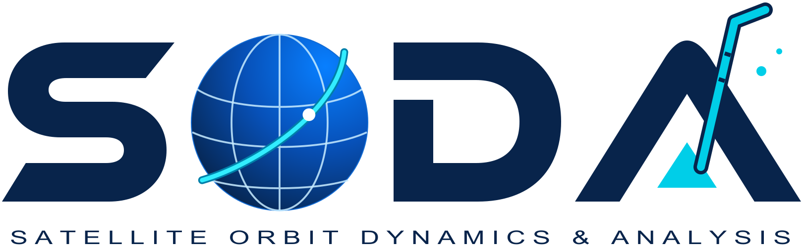
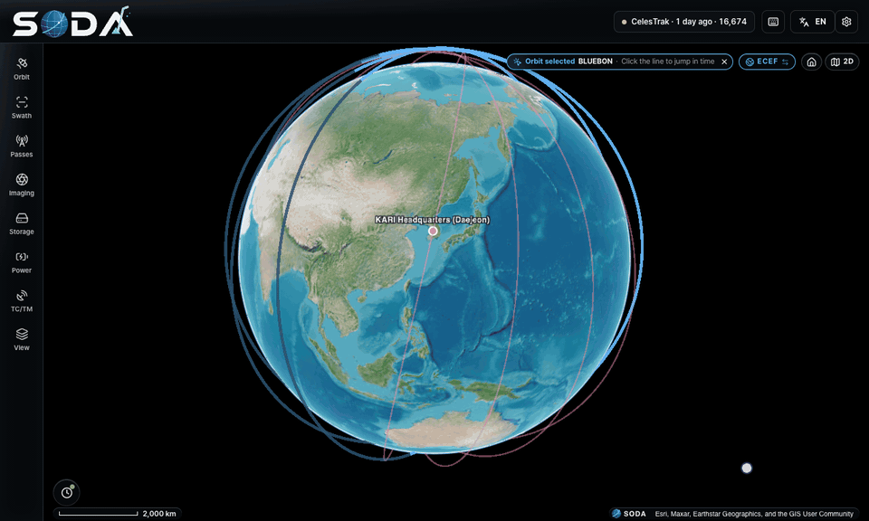
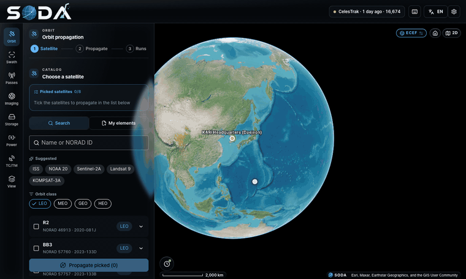
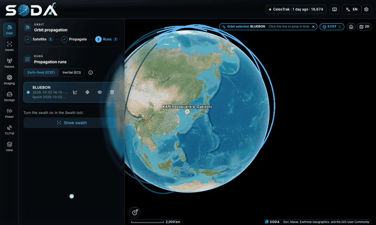
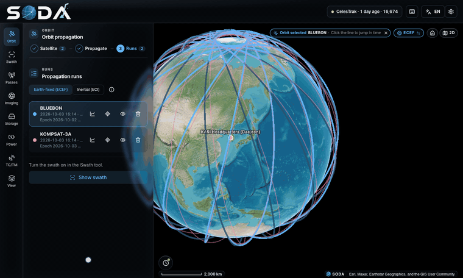
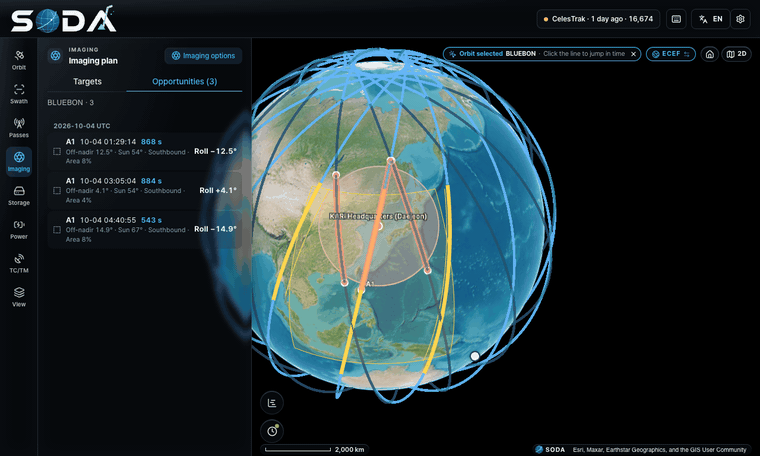
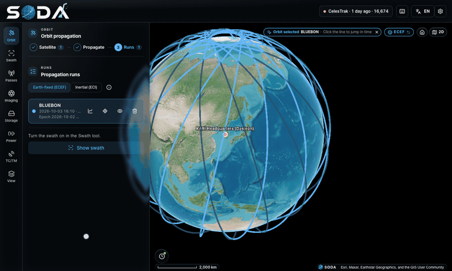
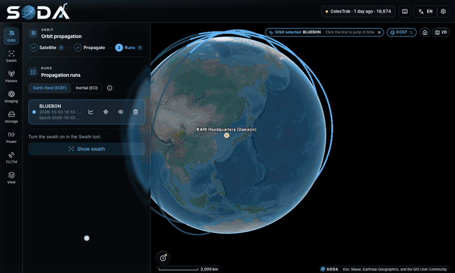
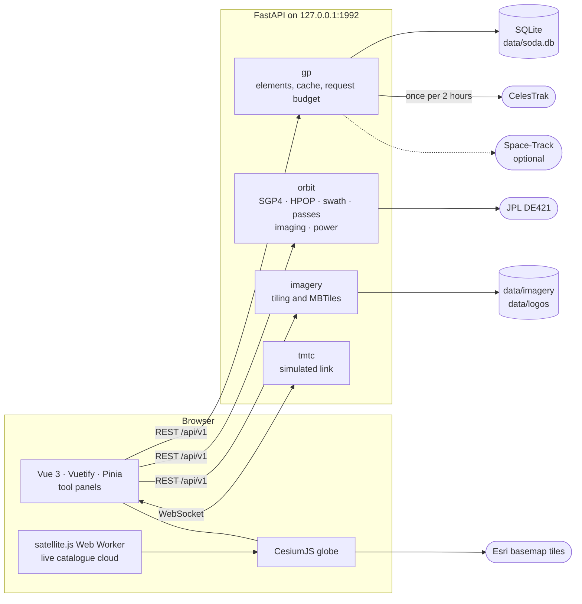

<div align="center">

<picture>
  <source media="(prefers-color-scheme: dark)" srcset="docs/images/soda-primary-dark.png">
  
</picture>

# SODA

**Propagate orbits, see swaths and plan passes on a 3D globe, all on your own PC.**

[](https://github.com/messy-snail/SODA/actions/workflows/ci.yml)
[](LICENSE)
[](https://www.python.org/)
[](https://nodejs.org/)


**English** · [한국어](README.ko.md)

</div>

<p align="center">
  
</p>
<p align="center"><sub>Basemap imagery © Esri, Maxar, Earthstar Geographics, and the GIS User Community</sub></p>

> [!NOTE]
> **Credits.** SODA uses [OrbitView](https://github.com/SpaceEngineerSS/OrbitView)
> (MIT) as a structural reference and adapts a few of its routines; the rest is
> written from scratch on Vue 3, Vuetify and CesiumJS with a FastAPI and Skyfield
> backend. See [THIRD_PARTY_NOTICES.md](THIRD_PARTY_NOTICES.md).

**S**atellite **O**rbit **D**ynamics & **A**nalysis is a local web tool for
mission analysis. It runs on `127.0.0.1`, needs no account and no map token, and
keeps its data in one SQLite file. The interface is in Korean and English, and
every time is UTC.

**Contents:** [Tour](#tour) · [Install](#install) · [Quick start](#quick-start) ·
[How it works](#how-it-works) · [Reference](#reference) ·
[Development](#development) · [License](#license)

## Tour

### 🛰️ Orbit propagation

<p align="center">
  
</p>

Search the catalogue by name or NORAD id, gather up to 8 satellites and propagate
them together. Each run charts its altitude and beta angle over the whole span,
and the view switches between Earth-fixed (ECEF) and inertial (ECI).

- **SGP4**, or **HPOP** numerical integration: EGM96 gravity up to 20×20, Sun and
  Moon gravity, Harris-Priester drag and solar radiation pressure.
- **Your own orbits**: paste or import TLE lists and OMM (JSON, XML, KVN, CSV),
  CCSDS OPM state vectors and OEM ephemerides.
- CelesTrak elements refresh on their own; Space-Track history is optional.

> [!IMPORTANT]
> HPOP started from a TLE or OMM inherits the error of those elements. It is
> there to compare perturbing forces, not to be more accurate than SGP4.

### 📡 Swath and field of regard

<p align="center">
  
</p>

Turn the swath on for a run to see the nadir swath, the field of regard inside the
tilt limit and the sensor footprint, computed on the WGS84 ellipsoid. A daylight
filter keeps only the stretches where the Sun is high enough at the subpoint.

Sensor presets are illustrative values, not published specifications. Enter the
swath width, maximum tilt and minimum Sun elevation yourself for real analysis;
see [`frontend/src/sensors/SOURCES.md`](frontend/src/sensors/SOURCES.md).

### 🗼 Pass prediction

<p align="center">
  
</p>

One prediction covers every propagated satellite and up to 8 ground stations:
AOS, TCA, LOS, maximum elevation and the visibility outline. When two satellites
want the same station at once, the higher priority gets it. A pass opens into a
sky plot with elevation, range, range-rate and Doppler curves.

- 43 published stations to pick from (NASA DSN and NSN, ESA ESTRACK, KSAT, JAXA,
  ISRO, CNES, KARI and others), each with a citable source in
  [`frontend/src/stations/SOURCES.md`](frontend/src/stations/SOURCES.md), or
  enter your own coordinates.
- Coordinates are site reference points, not antenna phase centres. The minimum
  elevation is a convention per network, not a published figure.
- An azimuth mask takes `(azimuth, minimum elevation)` pairs; a pass the mask
  interrupts becomes two contacts.

### 🎯 Imaging plan

<p align="center">
  
</p>

Click a point or drag out an area on the globe, then find when each satellite can
image it within its roll and pitch limits and a minimum Sun elevation. Every
opportunity lists its time, off-nadir angle and covered share, and jumps the
clock there with the imaged strip and the line of sight drawn.

### 🔋 Storage and power

<p align="center">
  
</p>

Both tools work from the imaging plan and the assigned passes of one satellite.

- **Storage** is a file-level recorder: each imaging window is a file, downlinked
  in contacts at the band and rate you set per station. It reports peak fill,
  what was lost and the latency to the ground.
- **Power** integrates the energy balance through eclipses with an
  equivalent-circuit battery, and reports the lowest state of charge and the
  deepest depth of discharge.

The models and their limits are described in
[docs/architecture.md](docs/architecture.md).

### 📟 TC/TM mock link

<p align="center">
  
</p>

A simulated spacecraft exchanges CCSDS packets with the ground during contacts,
driven by the simulation clock. Commands sent out of contact wait for the next
AOS; stored telemetry plays back when the link opens. It runs inside SODA only
and connects to no real system. See [docs/tmtc.md](docs/tmtc.md).

### 🗺️ Your own imagery

<p align="center">
  
</p>
<p align="center"><sub>Demo image derived from Satellogic EarthView, CC BY 4.0</sub></p>

Register MBTiles, a GeoTIFF or COG, or a plain image with four corner
coordinates. The server cuts it into Web Mercator tiles, the camera goes there,
and the imagery appears over the basemap once you are zoomed in on it. Large
files can be dropped into `data/imagery/inbox` instead.

<p align="center">
  
</p>
<p align="center"><sub>Sample imagery: Satellogic EarthView and Umbra Open Data Program, CC BY 4.0</sub></p>

Each set lists its sensor type and resolution, and one click flies to it. The
public catalogue tab searches Maxar Open Data (CC BY-NC 4.0, non-commercial
only) and OpenAerialMap for the area in view. Imagery that needs a login or an
order is never fetched for you.

The full description is in [docs/imagery.md](docs/imagery.md) (Korean).

### 🌗 2D map, day and night, eclipses

<p align="center">
  
</p>

Switch between the globe and a 2D map at any time. Night and the satellite's
eclipse stretches are shaded on the map, dimmed along the orbit line and marked
on the clock bar. Place search, pins, country borders and the layer switches
live in the **View** tool.

### 🗄️ Database and settings

<p align="center">
  
</p>

Everything SODA keeps is one SQLite file. The settings dialog shows where it is
and what it holds, tests a new path before you switch to it, and pages through
the raw rows of each table. Stations, sensor presets and custom elements export
to JSON and import again; the database file itself can be downloaded.

## Install

You need Python 3.12+, [uv](https://docs.astral.sh/uv/) and Node.js 22+. pnpm
runs through `npx`, so it does not have to be installed.

```bash
git clone https://github.com/messy-snail/SODA
cd SODA
uv sync
npx --yes pnpm@10.34.5 --dir frontend install --frozen-lockfile
npx --yes pnpm@10.34.5 --dir frontend build
```

> [!TIP]
> Optional sample imagery (high-resolution optical and SAR cut-outs, about
> 600 MB) lives in a separate repository. Fetch it with
> `git submodule update --init samples`. Some of it is non-commercial only; see
> `samples/SOURCES.md`.

## Quick start

```bash
uv run soda serve            # API and UI on http://127.0.0.1:1992
uv run soda serve --port 2000
uv run soda refresh          # fetch elements now (still one request per 2 hours)
```

Open <http://127.0.0.1:1992>.

1. **Orbit** - pick satellites, choose a span and press `Propagate`.
2. **Swath** - turn on `Draw swath` and set the swath width, tilt and Sun
   elevation.
3. **Passes** - choose ground stations and press `Predict passes`.
4. **Imaging** - add targets by clicking the globe, then compute opportunities
   for every propagated satellite.
5. **Storage**, **Power** and **TC/TM** work on one satellite, chosen at the top
   of each panel.

On first run SODA downloads the CelesTrak `active` group. The first swath or
pass request downloads the JPL DE421 ephemeris (about 17 MB) into
`data/ephemeris/`.

## How it works



- The backend computes everything that is reported as a number: propagation,
  swath geometry, passes, imaging opportunities, eclipses and the power budget.
  Sun and Moon positions come from Skyfield with JPL DE421.
- The browser draws. The cloud of every catalogued satellite is propagated live
  in a Web Worker; the simulation clock is the Cesium clock.
- Orbit elements are stored as OMM. TLE lines are generated for display only.

Structure, formulas and limits are in
[docs/architecture.md](docs/architecture.md) (Korean).

## Reference

<details>
<summary><b>Orbit elements and the CelesTrak request budget</b></summary>

- **CelesTrak** (default, no account): the backend fetches the `active` group as
  OMM JSON and caches it in SQLite. CelesTrak updates every 2 hours, answers 403
  to an earlier repeat and blocks an IP after 50 HTTP errors in 2 hours. SODA
  therefore asks **once per 2 hours** per group and per NORAD id, and keeps that
  rule across restarts.
- **Space-Track** (optional): with an account configured, a start time more
  than 3 days before the newest epoch uses the historical elements just before
  it.
- Catalogue numbers no longer fit the TLE format, so OMM is the internal
  standard and TLE lines are generated for display only.
- State vectors and ephemerides are not orbit elements. They can be propagated
  and shown, but passes, imaging and TC/TM need elements.

</details>

<details>
<summary><b>Settings, port and database</b></summary>

```bash
cp settings.example.toml settings.local.toml   # read automatically, never committed
```

- **Port**: `--port` > `SODA_PORT` > `port` in `settings.local.toml` > 1992.
- **Space-Track account**: `[spacetrack]` in that file, or
  `SODA_SPACETRACK_USERNAME` and `SODA_SPACETRACK_PASSWORD`.
- **Database** (shown in the tour above): `data/soda.db` by default. Point `database_url` or
  `SODA_DATABASE_URL` at another `sqlite:///<path>`; the settings dialog can
  test and save a new path.
- **Language**: the app bar button, or `?lang=en` for one visit.

</details>

<details>
<summary><b>Satellite shapes and logos</b></summary>

- A propagated satellite is drawn as a point, a sphere or a cube. Spheres and
  cubes carry a logo, chosen **per satellite → operator → default**.
- The operator is worked out from the satellite name
  (`frontend/src/utils/operators.ts`), so one Starlink logo covers every
  Starlink satellite.
- Thirty operator logos are bundled; their sources are in
  [`src/soda/assets/logos/SOURCES.md`](src/soda/assets/logos/SOURCES.md). For any
  other operator, upload your own PNG, JPEG, WebP or SVG in the app. It is
  stored in `data/logos/` and stays on your PC.

</details>

<details>
<summary><b>Basemaps and the Cesium ion logo</b></summary>

- The default basemaps are Esri tile services that need no token. Their
  attribution stays on screen at the bottom right. Heavy or commercial use may
  need an ArcGIS account.
- For Bing aerial imagery, put your own Cesium ion token in
  `frontend/.env.local` as `VITE_CESIUM_ION_TOKEN=...` and rebuild. Everything
  works without one.
- The Cesium ion logo is shown while an ion basemap is active. Otherwise SODA
  makes no request to ion and shows its own mark there.

</details>

## Development

```bash
uv run soda serve --reload                    # backend, restarts on change
npx --yes pnpm@10.34.5 --dir frontend dev     # http://127.0.0.1:5173, /api proxied to 1992

uv run ruff check src tests && uv run ruff format --check src tests && uv run pytest -q
npx --yes pnpm@10.34.5 --dir frontend typecheck
npx --yes pnpm@10.34.5 --dir frontend lint
npx --yes pnpm@10.34.5 --dir frontend test
npx --yes pnpm@10.34.5 --dir frontend test:browser   # needs a running server and a build
```

The clips on this page are recorded from the running app; see "README 영상 다시
만들기" in [docs/development.md](docs/development.md).

The deeper documents are written in Korean:
[architecture](docs/architecture.md) ·
[development](docs/development.md) ·
[TC/TM](docs/tmtc.md) ·
[brand](docs/brand.md) ·
[working rules](AGENTS.md).

## Contributing

Bug reports, ideas and pull requests are welcome, in English or Korean.

- 🐛 **Found a bug?** Open a [bug report](https://github.com/messy-snail/SODA/issues/new?template=bug_report.yml).
- 💡 **Have an idea?** Open a [feature request](https://github.com/messy-snail/SODA/issues/new?template=feature_request.yml).
- 🔒 **Security issue?** Report it privately - see [SECURITY.md](SECURITY.md).
- 🛠️ **Want to send code?** Start with [CONTRIBUTING.md](CONTRIBUTING.md).

## License

MIT - see [LICENSE](LICENSE). Third-party code, data and their terms are listed
in [THIRD_PARTY_NOTICES.md](THIRD_PARTY_NOTICES.md).

Bundled operator logos are **not covered by the MIT license**; they have
[their own terms](src/soda/assets/logos/LICENSE). They are
trademarks and property of their owners, used for identification only; no owner
endorses this project, and a logo is removed if its owner asks.
