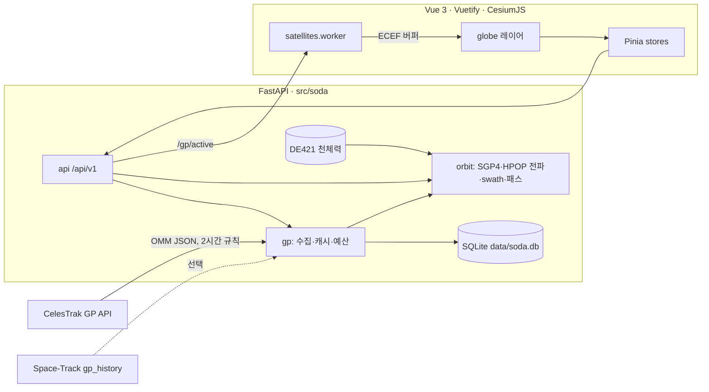

# 아키텍처

## 구성



- **FastAPI**: 빌드된 SPA(`src/soda/static/dist`)와 API를 함께 서빙한다.
- **Vite 개발 서버**: `/api`를 백엔드로 프록시한다.

## 백엔드 (`src/soda`)

| 모듈 | 역할 |
| --- | --- |
| `gp/models.py` | CelesTrak(숫자)과 Space-Track(문자열) OMM을 같은 숫자형 표준 필드로 정규화 |
| `gp/store.py` | 저장소 경계. `Store` Protocol과 백엔드가 지킬 계약(UTC, 최신 epoch만 덮어쓰기, `fetch_log`의 원자적 오류 카운트, 지상국 이름 중복 시 `StationNameTaken`), URL로 백엔드를 여는 `open_store` |
| `gp/sqlite_store.py` | 기본 백엔드 `SqliteStore`. `gp_latest`(객체별 최신 epoch), `gp_history`(Space-Track 이력), `group_members`, `fetch_log`, `stations`(`preset_id`·`az_mask` 포함), `sensor_presets`, `custom_elements`(사용자 TLE·OMM, 정규화한 OMM JSON). 새 컬럼은 `PRAGMA table_info` 기반 가산 마이그레이션으로 기존 DB에 붙인다 |
| `gp/tle.py` | 사용자 입력 궤도요소 해석. TLE 2~3줄(3LE `0 NAME` 포함)은 `tle_to_omm`으로 OMM으로 바꾸고, OMM JSON(객체 또는 1개짜리 배열)과 함께 `normalize_omm`과 SGP4 초기화 검사를 거친다. TLE 체크섬이 틀리면 거부한다(`Satrec.twoline2rv`는 검사하지 않음). `split_tle_records`는 2줄·3줄이 섞인 TLE 파일을 레코드로 나눈다 |
| `gp/element_files.py` | 궤도요소 파일 해석. 형식을 판별해(TLE, OMM JSON·XML·KVN·CelesTrak CSV) 레코드마다 `normalize_omm`과 SGP4 검사를 거친다. 못 쓰는 레코드는 `omm=None`으로 남겨 건너뛴 이유를 알려 주고, `plan_import`가 저장 이름을 정한다(같은 NORAD·epoch면 `duplicate`, 이름만 겹치면 ` (2)`). SGP4-XP 요소와 UTC가 아닌 시간계는 거부한다. 한도는 2 MiB, 500건 |
| `gp/ndm.py` | CCSDS NDM 공통 리더. KVN(`KEY = VALUE`)과 XML을 키·문자열로만 풀고, 날짜는 달력형과 day-of-year형을 읽는다. XML은 `<!DOCTYPE`·`<!ENTITY`가 있으면 파싱 전에 거절한다 |
| `gp/sqlite_custom.py` | `SqliteStore`의 mixin. `custom_elements`(여러 건 추가는 한 트랜잭션), `custom_states`(상태벡터, GCRS JSON), `custom_ephemerides`(ephemeris, 샘플은 float64 BLOB `[t_s, x, y, z, vx, vy, vz]`)의 조회·추가·삭제. 목록은 BLOB을 읽지 않고, DB 보기는 크기(`samples_bytes`)만 보여 준다 |
| `gp/celestrak.py` | 단일 요청과 응답 해석(200 / 403 not-updated / not found / error) |
| `gp/spacetrack.py` | 로그인 세션 재사용, 분당 30회·시간당 300회 슬라이딩 윈도 제한 |
| `gp/service.py` | 요청 예산(같은 키 2시간, 에러는 2분부터 지수 백오프), 신선도 판단, 이력 선택, 백그라운드 갱신 |
| `orbit/propagator.py` | Skyfield `EarthSatellite.from_omm`으로 벡터화 SGP4 전파. ITRS·GCRS·WGS84 측지 좌표, 30일·10만 샘플 제한. `ephemeris_from_gcrs`는 다른 전파기가 낸 GCRS 상태를 같은 Skyfield 호출로 같은 `Ephemeris`에 담는다 |
| `orbit/propagation.py` | 전파기 분기. 출처 종류마다 가능한 전파기를 정한다(`ALLOWED`): OMM은 `sgp4`(기본)·`hpop`, 상태벡터는 `hpop`, ephemeris는 `ephemeris`(보간). 어긋나면 `propagatorNotAllowed` |
| `orbit/hpop/` | 수치 전파기. GCRS에서 `r̈ = a_중력장 + a_해·달 + a_항력 + a_복사압`을 SciPy `solve_ivp`의 DOP853(rtol 1e-9, dense output)으로 적분한다. `gravity.py`는 번들 EGM96(최대 20×20)을 Cunningham 재귀로 합산하고, `atmosphere.py`는 Harris-Priester 밀도(100–1000 km, 평균 태양활동), `forces.py`는 3체·항력(지구와 함께 도는 대기)·복사압(원통 그림자), `environment.py`는 지구 자세(60초)와 해·달 위치(600초) 표를 미리 만들어 4점 Lagrange로 읽는다. `integrate.py`는 epoch에서 앞·뒤로 적분하고 고도 100 km에서 멈춘다. `propagate.py`가 진입점으로 위성 제원을 정하고(요청 → 저장값 → BSTAR → 기본값) 같은 초기 상태·힘 모델의 궤적을 8개까지 캐시한다 |
| `orbit/frames.py` | 상태벡터·ephemeris의 `REF_FRAME`을 GCRS로 변환. EME2000·GCRF·ICRF는 그대로, ITRF는 지구 자전을 되돌리고, TEME는 Skyfield `TEME` 회전을 쓴다 |
| `orbit/opm.py` | 상태벡터 입력. 폼 값과 CCSDS OPM(KVN·XML)을 GCRS로 바꾸고 검사한다(고도 100 km 초과, 묶인 궤도) |
| `orbit/oem.py` · `interpolate.py` | CCSDS OEM(KVN·XML) 읽기, 저장된 표의 Lagrange 보간(차수는 파일의 `INTERPOLATION_DEGREE`, 기본 7, 세그먼트를 넘지 않음), `write_oem`(전파 결과를 OEM으로) |
| `orbit/kepler.py` | 상태 하나에서 접촉 궤도 요약(주기·경사각·이심률·근/원지점). 궤도요소가 없는 출처의 표시용 |
| `gp/sources.py` | 궤도요소가 아닌 사용자 출처의 레코드: `CustomState`(상태벡터), `CustomEphemeris`(ephemeris) |
| `orbit/swath.py` | swath 경계 계산(numpy) |
| `orbit/sun.py` | DE421 기반 지구고정 태양 방향 |
| `orbit/passes.py` | Skyfield `find_events` 기반 패스와 가시 조건. 여러 지상국을 한 번에 계산하고, 마스크가 있으면 구간을 잘라낸다 |
| `orbit/horizon.py` | 방위각별 최소 고도각 마스크. `np.interp(..., period=360)`으로 랩어라운드 보간 |
| `orbit/footprint.py` | 최소 고도각 가시권 반경과 원. 방위각마다 다른 반경을 받으면 찌그러진 폴리곤이 된다 |
| `errors.py` | 사용자 문구의 코드 레지스트리(`ERROR_CODES`·`WARNING_CODES`)와 `CodedError` |
| `api/errors.py` | `detail`을 `{code, message, params}`로 내보내는 `ApiError` |
| `named_files.py` | `default`·기관 슬러그·NORAD 번호로 이름 붙인 파일 공통 저장소. 이름 검증, 원자적 저장, 목록 정렬, 읽기 전용 번들 디렉터리 폴백 |
| `logos.py` | 기관 로고. 업로드는 `data/logos`, 번들은 `src/soda/assets/logos`이고 같은 이름이면 업로드가 번들을 가린다. PNG 시그니처·IHDR 검증(2048 px·2 MB 이하) |
| `imagery/` | 사용자 영상. 어떤 형식으로 받든 세트 하나를 MBTiles 하나로 정규화한다. `mbtiles.py`(stdlib `sqlite3`로 검증·읽기·쓰기. 업로드한 파일은 읽기 전용·immutable로 열고 authorizer로 SELECT만 허용), `tiling.py`(Web Mercator 타일 계산, 네 모서리 검증, GCP 격자), `warp.py`(rasterio로 이미지+네 모서리, GeoTIFF, 장면 제품의 TIFF+네 모서리를 읽는다. 장면은 TIFF 안의 좌표 정보를 무시하고 표시 밴드만 scratch GeoTIFF로 옮긴 뒤 8비트여도 2~98% 구간으로 늘린다. rasterio는 함수 안에서만 import하므로 서버 시작과 타일 서빙에는 필요 없다), `cutting.py`(줌마다 블록 단위로 워핑해 타일을 쓴다. 낮은 줌은 GeoTIFF의 오버뷰에서 읽고, 타일 수가 한도를 넘으면 최대 줌을 낮춘다), `library.py`(`data/imagery/<id>.mbtiles`와 `<id>.json` 사이드카. 사이드카가 생겨야 세트가 존재한다. 두 번째 폴더 `samples_root`는 `samples` 서브모듈의 `imagery/`이고 읽기만 한다: 목록에서 사용자 세트 뒤에 이름순으로 오고, 세트 수에 세지 않으며, 같은 id의 사용자 세트가 앞선다. 사이드카의 `sensor`(`optical`·`sar`)와 `label`(`{ko, en}`)은 없어도 읽힌다), `jobs.py`(변환 작업을 한 번에 하나씩 스레드로 실행. 상태는 메모리에만 두고, 작업마다 단계 `queued`·`downloading`·`tiling`과 진행률을 가진다), `inbox.py`(감시 폴더 `data/imagery/inbox`. 5초마다 훑어 크기·수정 시각이 두 번 연속 같고 10초가 지난 파일을 `.processing/<id>/`로 옮겨 가져온 뒤 `done/`이나 `failed/`로 옮긴다. 이미지는 같은 이름의 `.json`에 `corners_deg`가 있어야 한다. 재시작하면 `.processing`의 파일을 되돌린다. `.zip`과, 안에 `METADATA.DIM`이 있는 폴더는 장면 제품으로 본다. 폴더는 안의 파일 전체 크기와 가장 늦은 수정 시각으로 안정 여부를 판단하고 통째로 옮긴다), `products.py`(장면 제품 찾기. 폴더는 두 단계 아래까지, zip은 멤버 이름으로 `METADATA.DIM`을 찾고 정확히 하나여야 한다. zip에서는 영상 파일 하나만 `extracted.tif`로 스트리밍 복사하며 선언 크기와 실제 크기를 모두 검사한다), `dimap.py`(SPOT 장면 DIMAP 1.1. `Dataset_Frame`의 꼭짓점을 행·열로 정렬해 좌상·우상·우하·좌하 모서리를 만들고, 영상 파일 이름·표시 밴드·촬영 시각·저작권 표기를 읽는다. XML은 `gp/ndm.parse_xml`로 읽어 DOCTYPE을 거절한다), `catalog/`(공개 카탈로그. `http.py`는 허용 호스트에 https로만 요청하고 리다이렉트를 따라가지 않으며 크기를 스트리밍 중에 검사한다. `cache.py`는 카탈로그 문서를 `data/imagery/.cache/catalog`에 TTL로 둔다. `maxar.py`는 정적 STAC을 훑는다: 이벤트 문서의 bbox 목록으로 촬영 컬렉션을 고르고, 촬영 컬렉션의 bbox 목록으로 타일을 고른다. 첫 검색은 이벤트 문서 전체(56건)를 받고 그 뒤는 캐시로 답한다. `oam.py`는 OpenAerialMap 검색 API를 한 번 부른다. `service.py`가 둘을 묶는다), `limits.py`(한도) |
| `models3d.py` | `data/models`의 사용자 3D 모델. GLB 헤더·JSON 청크 검증(외부 파일 참조 거부, 64 MB), `<name>.json` 표시 설정. 웹 UI에서는 기본으로 숨긴다 |

### 저장소 백엔드

- **백엔드 선택**: `database_url` 설정(`SODA_DATABASE_URL`)으로 고른다. 비어 있으면 `sqlite:///<data_dir>/soda.db`를 쓴다. 지금 지원하는 scheme은 `sqlite:///` 하나다.
- **API와 서비스**: `Store` Protocol에만 의존한다. SQLite 예외는 `sqlite_store.py` 밖으로 나오지 않는다.
- **새 백엔드를 추가하는 순서**
  1. `Store`를 구현한다.
  2. `gp/store.py`의 `open_store`와 `SUPPORTED_SCHEMES`에 scheme을 추가한다.
  3. `tests/test_store.py`의 `store` fixture `params`에 추가한다.
  - 이 fixture를 쓰는 테스트가 계약 테스트다. 스키마·마이그레이션 테스트는 SQLite 전용이다.
- **`fetch_log` 오류 카운트**: `GPService`는 CelesTrak 요청 예산과 백오프를 `fetch_log`에서 계산한다. 새 백엔드도 `record_fetch`의 오류 카운트를 원자적으로 갱신해야 한다.

### Swath 계산

샘플마다 다음 순서로 좌/우 경계점을 구한다.

1. 위성 위치의 측지 위경도에서 타원체 법선을 구하고, 그 반대 방향을 nadir `d₀`로 둔다.
2. 지구고정 속도를 nadir에 수직인 평면에 투영해 진행 방향 `a`를 구하고, `a × up`을 오른쪽 방향 `r`로 둔다.
3. look 벡터 `cosθ·d₀ ± sinθ·r`와 WGS84 타원체의 교점을 좌/우 경계점으로 삼는다.
   - 교점은 좌표를 `(a, a, b)`로 스케일한 뒤 단위구와의 이차방정식으로 푼다.
   - 지평선을 넘는 각은 `asin(R_local/|r|) − 0.2°`로 제한한다.
4. 각도 θ는 swath 종류에 따라 정한다.
   - nadir swath: `θ = FOV/2`
   - Field of Regard: `θ = 최대 off-nadir + FOV/2`
   - 관측폭(km)을 입력하면 평균 고도에서 구면 근사 `η = atan(sin λ / ((R+h)/R − cos λ))`, `λ = swath/2R`로 FOV를 구한다.
5. 주간 판정: subpoint의 local up과 태양 방향의 내적이 `sin(최소 태양고도)` 이상이면 주간이다.
   - 상태가 바뀌는 지점에서 세그먼트를 나눈다.
   - 인접 세그먼트는 경계 샘플을 공유한다.

프런트엔드(`globe/swathLayer.ts`)는 그리는 비용을 줄이려고 지형에 붙이지 않는다. 지구본에 지형이 없어서 결과는 같다.

- 경계선은 `PolylineCollection`이다. 샘플 사이 직선이 지면 아래로 꺼지지 않게 50 km 이하로 쪼개 타원체 위에 올린다. 12 km 같은 좁은 swath도 멀리서 보인다. 밤 구간(직하점 태양고도 미달)은 점선이다.
- 채움은 세그먼트를 약 4분 분량씩 나눈 `PolygonGeometry`의 일반 `Primitive`다. 시간 블록(한 궤도 또는 run의 1/24 중 긴 쪽)마다 종류×주야별로 하나씩 만들고, 시계에 가까운 블록부터 앞 블록이 준비되면 다음 블록을 추가한다. 다 그릴 때까지 `selection.drawing`이 참이다.
- 표시 토글(nadir·FoR·주간만)은 다시 요청하지도 다시 만들지도 않고 `show`만 바꾼다.
- 지면 분류 방식(`GroundPrimitive`·`GroundPolylinePrimitive`)은 쓰지 않는다. 경계선을 약 10 km마다 다시 쪼개고 채움을 shadow volume으로 그려서, 헤드리스 Chromium 기준 1일 run 14초·7일 run 91초가 걸렸다(지금은 2초·7초).
- `?e2e`에서는 마지막 빌드 시간이 `window.__sodaSwathTiming`에 남는다.

### 패스 계산과 방위각 마스크

지상국에 마스크가 없으면 Skyfield `find_events`의 결과를 그대로 쓴다. 마스크가 있으면 두 단계로 나눈다.

1. 유효 지평선은 `h(az) = max(요청 최소 고도각, 마스크(az))`다. 선형 보간의 최솟값은 정점의 최솟값과 같으므로
   `max(최소 고도각, 마스크 최솟값)`으로 `find_events`를 돌리면 통과 구간을 하나도 놓치지 않는 상위집합이 나온다.
2. 각 후보 창을 4초 격자로 샘플링하고, 인접 샘플의 방위각 차이가 1°를 넘으면 그 사이를 더 쪼갠다.
   좁은 노치를 건너뛰지 않기 위해서다. 모든 창의 샘플을 한 배열로 모아 `altaz`를 한 번만 호출한다.
3. `고도각 >= h(방위각)`인 연속 구간을 찾고, 경계는 벡터 이분법 12회로 정밀화한다. `고도각 - h(방위각)`는
   마스크 정점에서 꺾이므로 할선법 대신 이분법을 쓴다.
4. 한 창이 여러 조각으로 갈라지면 각각 독립 패스가 된다. 차폐 구간은 교신이 끊기므로 별개 contact이다.
   조각들은 같은 `pass_index`를 공유하고, 마스크가 경계를 정한 조각은 `mask_limited`가 된다.

이벤트 검색은 요청 구간보다 앞뒤로 30분(`EDGE_LOOKAROUND`) 넓게 돌린다. 구간 시작에 이미 교신 중이던 패스도
실제 AOS·LOS를 갖기 때문에 AOS/LOS 핀이 가시권 원의 경계에 온다. 구간과 겹치는 패스만 남기고, 구간 밖으로 걸친 패스는
`partial`이 된다. 30분보다 긴 교신(MEO·GEO)만 넓힌 경계에서 잘리며 `clipped_start`·`clipped_end`로 알린다.

가시권 외곽선도 마스크를 따른다. 구면 근사에서 지상국→subpoint 대권 방위각은 위성의 토포센트릭 방위각과 같으므로,
방위각 β의 경계 반경은 `footprint_radius_km(평균 고도, h(β))`다. `visibility.radius_km`은 가장 멀리 닿는 값이다.

30일 × 8지상국이 약 2.4초 걸린다. `asyncio.to_thread`는 한 번만 쓰고 그 안에서 지상국을 돈다.

### 패스 상세 그래프와 궤도 시계열

패스 행의 그래프 버튼은 그 패스의 스카이 플롯과 고도각·거리·거리 변화율 곡선을 연다(`PassDetailDialog.vue`·`SkyPlot.vue`). 서버를 부르지 않고 `orbit/passGeometry.ts`가 `Pass.track_fixed_m`과 지상국 위치로 계산한다.

- 고도각·방위각·거리는 지상국의 동·북·천정 축에 투영해 구한다. 대기 굴절은 넣지 않는다.
- 거리 변화율은 거리 수열의 4차 차분이다. 거리는 좌표계와 무관하므로 지구고정 궤적에서 바로 나온다. 2차 차분은 천정 통과의 TCA 근처에서 수십 m/s 틀린다.
- 도플러는 단방향 `-f·ṙ/c`이고, 반송파 주파수는 창에서 입력한다(기본 2200 MHz, 저장하지 않는다). 지상국에는 주파수 필드가 없다.
- 궤적이 10초 간격(긴 교신은 최대 400점)이라 값은 표시용이다. 안테나 지향이나 주파수 보정에 쓰지 않는다.
- 스카이 플롯의 바깥 띠는 지상국이 요구하는 고도각이다. `requiredElevationDeg`가 `HorizonMask.elevation_at`과 같은 선형 보간으로 그린다.

전파 결과의 그래프 버튼은 run 전체의 고도와 베타각을 연다(`RunSeriesDialog.vue`). 고도는 `alt_km`을, 베타각은 `/propagate`의 `beta_offset_s`·`beta_deg`를 쓴다. 베타각은 백엔드 `orbit/sun.py`의 `beta_series_deg`가 DE421로 계산하고, `/power`의 `beta_start_deg`·`beta_end_deg`는 같은 계산의 첫·끝 값이다. 긴 run의 고도는 구간마다 최저·최고만 남겨 그린다(`utils/levelChart.ts`의 `thinExtremes`). 이 필드가 생기기 전에 저장된 run은 베타각이 없어 다시 전파해야 한다.

### 여러 위성의 패스와 충돌 배정

`/passes`는 위성을 여러 개(최대 8개) 받는다. 배열 순서가 우선순위다.

1. 위성마다 자기 전파 구간에서 `find_passes_multi`로 모든 선택 지상국의 패스를 찾는다. 위성 수 × 일수는 60 이하다. 프런트는 넘으면 각 run을 균등하게 앞에서부터 자른다(`utils/passPlan.ts`의 `planWindows`).
2. 지상국 안테나는 한 번에 위성 하나만 추적하고, LOS 뒤 `turnaround_s`(기본 60초)만큼 전환 시간이 필요하다. 같은 지상국에서 `[AOS, LOS + turnaround)` 구간이 겹치면 충돌이다. 모든 패스는 겹치는 상대를 `conflict_with`에 나열한다.
3. 위성 우선순위 → AOS 순으로 탐욕 배정한다(`orbit/contacts.py`의 `schedule`). 이미 배정된 패스와 겹치면 `rejected`다. 제외된 패스는 다른 패스를 막지 않는다.
4. 스케줄러는 순수 함수라 DE421 없이 `tests/test_contacts.py`로 검증한다.

위성이 하나면 결과는 예전 단일 위성 패스 예측과 같다(모두 `assigned`). 프런트는 패스 목록, 하단 시간표, 지구본, 교신 중 칩이 모두 이 결과 하나를 쓴다.

### 저장량과 다운링크

온보드 레코더를 영상 파일 단위로 모의한다. 프런트에서만 계산하고 서버를 부르지 않는다. 설정은 `mission/storage.ts`, 계산은 `mission/recorder.ts`의 `simulateRecorder`, 교신 구간은 `mission/linkWindow.ts`, 입력 조립은 `stores/storage.ts`다.

**입력**
- 촬영: 촬영 기회 결과에서 고른 창마다 영상 파일 하나다. 구간은 서버가 준 `shot_start`~`shot_end`이고, 크기는 `촬영 데이터율 × 구간 길이 ÷ 압축비`다.
- 교신: 패스 예측에서 같은 run의 `assigned` 패스 중 다운링크를 켠 지상국의 것이다. 지상국마다 밴드(S·X)와 속도를 둔다. 기본은 X밴드이고, 속도를 따로 주지 않으면 그 밴드의 속도를 쓴다.
- 지상국 설정은 지상국 DB가 아니라 `mission.saved.storage`에 둔다(`noDownlinkStationIds`는 끈 지상국, `stationLinks`는 기본값과 다른 지상국). 밴드와 속도는 사용자가 넣는 값이고 프리셋에는 없다.

**데이터를 보낼 수 있는 구간**
- S밴드는 AOS~LOS 전체다. X밴드는 고도각이 `xMinElevDeg`(기본 5°) 이상인 구간이다.
- 고도각은 `Pass.track_fixed_m`(AOS~LOS를 10초 간격으로 균등 샘플링한 ITRS 위치)과 지상국의 WGS84 위치·측지 법선으로 구한다. 문턱을 지나는 시각은 인접 샘플 사이를 선형 보간한다. 양 끝의 오차는 1초 안쪽이다(`linkWindow.test.ts`가 해석해와 비교한다).
- 문턱이 지상국의 `min_elev_deg` 이하면 패스 전체를 쓴다. 최고 고도각이 문턱보다 낮으면 구간이 없다. 궤적이 비어 있으면 패스 전체로 본다.
- 어느 밴드든 구간의 시작에서 `lockS`(링크 확립 시간, 기본 10초)를 뺀다. 남는 구간이 없는 교신도 목록에는 나온다.

**규칙**
1. 촬영을 시작할 때 남은 공간에 영상 전체가 들어가야 저장한다. 진행 중인 촬영의 크기는 미리 잡아 둔다. 들어가지 않으면 그 영상은 저장하지 않고(`lost`), 촬영 구간이 그래프의 빨간 띠가 된다. 잘라서 저장하지 않는다.
2. 저장한 파일은 촬영하는 동안 일정하게 커진다. 저장량은 조각별 직선이고 용량을 넘지 않는다.
3. 촬영이 끝난 파일만 내려보낸다.
4. 링크는 한 번에 하나다. 구간이 겹치면 가장 빠른 링크를 쓴다(같으면 먼저 열린 쪽, 그다음은 지상국 id).
5. 순서는 오래된 순(촬영 종료 시각)이다. `priority` 재생이면 긴급 표적(`urgentTargetIds`)의 영상이 먼저 가고 그 안에서 오래된 순이다. 보내던 파일은 밀려나도 보낸 양을 유지하고 다음 구간에서 이어 보낸다.
6. 보낸 만큼 바로 지운다. 수신 확인을 기다리지 않는다.
7. 시작 저장량은 가장 오래된 파일 하나로 다룬다. 영상 수와 지연시간 통계에는 넣지 않는다.
8. 지연시간은 촬영 종료부터 마지막 비트를 보낸 시각까지다. 평균과 최대는 다 내려보낸 영상만 센다.

**결과**: 저장량 곡선, 영상별 상태(수신·대기·손실)와 수신 지상국·지연시간, 교신별 사용 가능 시간·보낼 수 있는 양·보낸 양, 합계(촬영량·내려받은 양·최대 사용률·끝에 남은 양·저장 못 한 영상·지연시간).

**한계**
- 수신 확인 뒤 삭제, 덮어쓰기(circular) 저장, 하우스키핑 데이터, 고도각에 따라 바뀌는 속도(VCM)는 계산하지 않는다.
- 촬영과 다운링크를 동시에 할 수 있다고 본다. 자세 충돌과 기동 시간은 보지 않는다.
- 전력 도구는 다운링크를 켠 지상국의 교신을 밴드와 상관없이 AOS~LOS 전체 동안 다운링크 부하로 계산한다. X밴드 구간이 더 짧거나 없어도 그렇다.
- 촬영·패스는 SGP4 결과인데 run은 HPOP이나 ephemeris일 수 있다.

### 전력: 배터리 SOC와 DOD

`orbit/power.py`가 전파한 궤도 위에서 배터리 에너지를 적분하고, `orbit/power_geometry.py`가 태양전지 입사각을 계산한다. 1차 에너지 수지 모델이다.

```text
P_gen = array_w · (1 AU / r)² · max(cosθ, 0)      식(eclipse) 구간에서는 0
잉여:  E += (P_gen − P_load) · charge_efficiency · Δt      용량에서 멈추고 남는 발전은 shunted_wh
부족:  E −= (P_load − P_gen) / discharge_efficiency · Δt   0에서 멈추고 못 준 부하는 unmet_wh
SOC = E / capacity_wh,  DOD = 1 − SOC
```

- **자세 가정**: 태양전지는 카메라 반대면에 고정이다(법선 = −시선). 평소에는 태양을 향해 `cosθ = 1`이다. 촬영 중(앞뒤 `slew_s` 포함)에는 그 촬영의 롤·피치 자세로, 교신 중에는 `contact_attitude`에 따라 태양 지향 유지(`sun`), 지구 지향(`nadir`), 지상국 추적(`station`)으로 계산한다. 겹치면 촬영 자세가 우선이다.
- **시작 상태**: `initial_soc_pct`는 `soc_at` 시각의 값이다. `soc_at`을 주지 않으면 run의 시작 시각이다. 적분은 그 시각부터 run의 끝까지 하고, 그 앞은 계산하지 않는다. 발전량·소비량·최저 SOC도 그 구간의 값이다(`eclipse_s`·`eclipse_fraction`·베타각은 run 전체 기준). 시계를 움직여도 다시 계산하지 않는다.
- **부하**: `base_w`는 항상, `imaging_w`는 촬영 구간에, 교신 구간에는 다운링크 지상국이면 `downlink_w`, 아니면 `contact_w`를 더한다. 교신이 겹치면 큰 쪽 하나만 더한다.
- **적분**: 식 경계·구간 경계에서 나누고, 태양 지향을 벗어난 구간은 5초 간격으로 더 나눈다(전체 5만 구간을 넘으면 간격을 늘린다). 구간 안에서는 전력이 일정하므로 0이나 용량에 닿는 시각을 해석적으로 구한다.
- **기하**: 샘플 사이 위치·속도는 ITRS에서 Lagrange 보간(`orbit/interpolate.py`)한다. 전파 간격이 120초보다 크면 `powerCoarseStep` 경고를 낸다. 태양 방향·거리와 식 구간은 DE421로 계산한다.
- **한계**: 본영만 식으로 본다. 패널 자체 그림자, 온도, 배터리 전압 곡선, 열화는 계산하지 않는다. 촬영 롤·피치는 `best_time` 값을 촬영 내내 유지한다. 촬영·패스는 SGP4 결과인데 run은 HPOP이나 ephemeris일 수 있다(저장량 도구와 같은 불일치).
- 식의 구조는 Basilisk `simpleSolarPanel`·`simpleBattery`(ISC)와 같고 경로 효율을 더했다. 코드는 가져오지 않았다.

배터리 모델은 둘이다. 요청에 `power.battery`가 없으면 위의 에너지 수지(`capacity_wh`와 효율 둘)이고, 있으면 `orbit/battery.py`의 등가회로다.

```text
V = OCV(SOC) − I·R                      I > 0 이 방전
방전: P = V·I  →  I = (OCV − √(OCV² − 4·R·P)) / 2R,   V ≥ V_min (차단, 나머지는 unmet_wh)
충전: P = V·|I| →  |I| = (−OCV + √(OCV² + 4·R·P)) / 2R
      |I| ≤ I_max,  V ≤ V_max  →  |I| ≤ (V_max − OCV)/R   (남는 발전은 shunted_wh)
dSOC/dt = −I / capacity_ah
```

- 개방전압 곡선은 셀 하나의 `(SOC %, V)` 점을 구간별 직선으로 잇고 직렬 셀 수를 곱한다. 가득 찰수록 `V_max`까지 남은 전압이 줄어 충전 전류가 줄어든다(정전압 구간).
- 효율 둘은 변환기(경로) 효율로 남고, 배터리 안의 손실은 `I²R`(`loss_wh`)다.
- 전류가 SOC에 달려 있으므로 구간을 10초 이하로 나눠 중점법으로 적분한다(전체 30만 스텝을 넘으면 간격을 늘린다). 응답 시계열은 시간 칸 3000개마다 처음과 마지막 점만 남긴다. 최저·최고 값은 솎기 전 값이다.
- `capacity_wh`는 이 모드에서 곡선 아래 넓이(`∫OCV dQ`)다.
- 기본 곡선(`DEFAULT_OCV_*`)은 리튬이온의 일반적인 모양을 보여 주는 예시이고 특정 셀의 데이터가 아니다. 실제 값은 사용자가 데이터시트에서 넣는다. 온도, 열화, 분극 같은 느린 동특성은 계산하지 않는다.
- 프런트는 `stores/power.ts`가 대상 위성(선택된 run, 없으면 첫 run)과 그 위성의 촬영 결과·배정된 패스로 요청을 만들고, 입력이 바뀌면 다시 요청한다. 결과는 run id가 아니라 위성(`satKey`)으로 찾으므로 다시 전파해도 이어지고, 그때는 패널에 이전 전파 기준이라는 칩이 뜬다. 다른 위성에는 패스 계획이나 촬영 결과가 있는데 이 위성에만 없을 때도 칩으로 알린다.
- 저장량·전력·TC/TM은 위성 하나만 다룬다. 대상 위성은 세 도구가 같은 규칙(`targetRun`)으로 정하고 패널의 선택기(`RunSelect.vue`)에 궤도 색과 이름으로 보인다. 배터리·저장 용량·자세 한도 설정은 위성마다 따로 두지 않고 한 벌을 같이 쓴다. 저장량 도구에서 뺀 촬영 창과 다운링크를 끈 지상국을 그대로 따른다.

### 촬영 기회 계산

`orbit/access.py`가 탐색 흐름을, `orbit/access_geometry.py`가 기하를 맡는다.

**각도 정의**
- 롤은 진행 방향에 수직(cross-track)인 기울기다. 오른쪽이 +이고, swath의 `r` 방향과 같다.
- 피치는 진행 방향(along-track)으로의 기울기다. 앞쪽이 +다.
- 둘 다 측지 nadir 기준이다. 시선벡터를 nadir·`r`·진행 방향 성분으로 나눠 `atan2`로 구한다.
- 롤 도달 범위는 `최대 롤 + FOV/2`다. 표적이 영상 가장자리에만 들어와도 촬영으로 본다.
- 공통 조건은 표적이 위성 지평선 위에 있고, 표적의 태양고도가 `min_sun_elev_deg` 이상인 것이다.

**자세 모델(`mode`)**
- `roll`(기본): 롤만 쓴다.
  - 점 표적은 15초 격자에서 피치가 +에서 −로 바뀌는 구간을 찾고, 이분법 14회로 피치 0 시각을 구한다. 그 시각에 롤 도달 범위·지평선·태양을 검사한다. 창은 그 한 순간이다(`start = end = best_time`, `duration_s = 0`).
  - 영역은 그 시각의 진행 수직면이 지면과 만나는 호(도달 범위 안 41점)가 영역의 밝은 부분과 만나는 동안이 창이다. 촬영 띠가 영역을 쓸고 지나가는 시간이다.
    - 직하점이 영역에서 `영역 반경 + 지상 도달거리`보다 멀면 호를 만들지 않는다.
    - 5×5 격자점마다 1초 간격으로 피치 0 시각을 찾는다. 그때 조건을 통과한 비율이 `coverage`다.
    - 최적 시각은 영역 중심의 피치 0 시각이고, `roll_deg`는 덮인 격자점이 필요로 한 롤의 중앙값이다.
- `roll_pitch`: 롤과 피치를 각각 한도 안에서 쓴다.
  - `|롤| ≤ 최대 롤 + FOV/2`이고 `|피치| ≤ 최대 피치`인 동안이 창이다. 푸시브룸이라 진행 방향 FOV는 무시한다.
  - 경계는 이분법 6회(약 0.25초)로 찾는다.
  - 점 표적의 최적 시각은 `|피치|`가 가장 작은 순간이다(삼분 탐색).
  - 영역은 직하점을 영역 안으로 자른 점을 겨눈다. 최적 시각은 `coverage`가 가장 큰 격자 샘플이고, 덮인 격자점의 가운데를 겨눈다.

**결과**
- 창마다 `roll_deg`, `pitch_deg`, `min_off_nadir_deg`(합성각), `aim_lat_deg`·`aim_lon_deg`, `target_sun_elev_deg`, `coverage`, `ascending`을 낸다.
- 창이 요청 구간 끝에 걸리면 `clipped_start`·`clipped_end`다.
- 15초보다 짧게 스치는 창은 놓칠 수 있다.

**촬영 띠**: 창마다 촬영 구간(`shot_start`~`shot_end`)을 정한다.
- 롤만 + 영역은 쓸고 지나가는 창 전체다.
- 그 밖은 `best_time ± shot_s/2`를 창 안으로 자른 구간이다. 롤만 + 점처럼 창이 더 짧으면 자르지 않는다.
- 그 구간을 1초 간격(최대 600점)으로 샘플해 창의 롤을 유지한 채 `롤 ± FOV/2` 경계를 지면에 투영한다(`strip`). FOV가 0이면 ±0.25°로 얇게 그린다.
- 위성 위치(`track_fixed_m`)도 함께 낸다. `orbit/access_strip.py`가 맡는다.
- 프런트는 띠·궤적 구간·시선을 `globe/accessLayer.ts`로 그린다. 저장량 도구도 같은 촬영 구간을 영상 파일 하나로 계산한다.

**진단(`diagnosis`)**: 표적마다 창이 왜 그만큼인지 알려 준다. 표적 중심의 피치 0 통과를 15초 격자에서 찾아, 통과에 가장 가까운 격자 샘플의 롤과 태양고도로 센다(`_Search.diagnose`).
- `passes`는 중심이 롤 도달 범위 안이고 지평선 위였던 통과 수, `dark`는 그중 태양고도가 모자랐던 수다.
- `best_sun_elev_deg`는 어두웠던 통과 중 가장 높은 태양고도, `nearest_roll_deg`는 지평선 위 통과 중 가장 작은 롤이다(없으면 null).
- 영역도 중심점 기준이고 격자 샘플 값이라, 롤 한도에 딱 걸린 통과에서는 창 수와 하나쯤 어긋날 수 있다. 사유를 보여 주는 용도다.
- 프런트는 표적 목록에 한 줄로 보여 준다(`mission/targets.ts`의 `accessReason`): 기회 수, 태양고도 부족, 롤 범위 밖, 통과 없음.
- 관측폭 띠는 기하만 보여 주고 주야를 직하점으로 판정한다. 촬영 기회는 표적의 태양고도로 판정하므로, 띠 안에 있는 표적이 태양고도 때문에 빠질 수 있다. 지구본에 그린 관측폭의 센서와 촬영 설정(롤·FOV·최소 태양고도)이 다르면 가져오기 버튼 아래에 알려 준다(`mission/sensorImport.ts`의 `pointingDiffers`).
- 촬영 기회는 전파한 위성 가운데 궤도요소가 있는 것 전부(최대 8개)를 계산한다. API는 위성 하나만 받으므로 프런트(`stores/mission.ts`의 `compute`)가 위성마다 자기 전파 구간으로 요청하고(동시에 3개), 한 위성이 실패해도 나머지 결과는 쓴다. 결과는 `mission/shots.ts`가 시간순 한 목록으로 합치고, 위성이 여럿이면 목록과 지구본에서 위성의 궤도 색으로 구분한다. 자세 한도·촬영 길이 설정은 모든 위성이 같이 쓴다. 표적 목록의 한 줄 사유는 위성들의 진단을 합쳐서 낸다(`mergeDiagnoses`: 통과 수는 더하고, 태양고도는 가장 높은 값, 롤은 가장 작은 값).

**성능**: 30일 × 표적 20개(점·영역 반반)는 `roll`과 `roll_pitch` 모두 약 4~5초 걸린다(띠 포함). 한도는 전파 한도(30일)와 같아서 전파 구간 전체를 한 번에 계산할 수 있다.

**프런트**: 레일의 촬영 계획 도구에서 모델과 한도를 고른다. "관측폭 센서 값 가져오기"는 관측폭 도구 센서의 최대 off-nadir를 최대 롤로, FOV를 FOV로 가져온다. 그래서 지구본의 FOR 띠와 같은 기준이 된다.

### 커버리지와 재방문

웹 UI의 커버리지 분석 도구는 `VITE_SODA_COVERAGE=1`로 빌드할 때만 보인다. `/coverage`는 계속 동작한다.

레일의 `커버리지 분석` 도구는 촬영 계획의 박스 표적 하나를 `nx × ny` 칸으로 나누고, 칸마다 얼마나 자주 찍을 수 있는지를 지구본에 색으로 칠한다(`orbit/coverage.py`, `mission/coverage.ts`).

- **판정**: 칸은 중심점 하나로 본다. 자세 모델과 조건(롤 도달, 시야, 태양고도)은 촬영 기회와 같고, 태양고도는 칸마다 따로 본다.
- **기회**: `roll`은 피치 0을 지나는 순간, `roll_pitch`는 조준 가능한 구간마다 하나(피치 0에 가장 가까운 때)다.
- **탐색**: 촬영 기회와 같은 15초 격자를 쓴다. 박스에 닿을 수 있는 샘플만 남기고, 한 통과의 모든 칸을 한꺼번에 계산한다. 피치 0 통과는 이분법 대신 두 샘플 사이를 선형 보간해서 시각 오차가 1~2초다. `access_report`와 칸별 건수가 같고 시각이 2초 안에 드는지를 `tests/test_coverage.py`가 검사한다.
- **응답**: 서버는 칸별 기회 시각만 준다. 위성을 어떻게 묶어 보느냐에 따라 간격이 달라지므로 지표는 프런트가 낸다.
- **분석 구간**: 포함한 위성들이 함께 전파된 구간(가장 늦은 시작 ~ 가장 이른 끝)이다. 겹치는 구간이 없으면 위성 하나를 골라 본다.
- **지표**
  - 횟수: 구간 안의 기회 수. 위성이 여럿이면 같은 통과도 위성마다 센다.
  - 최대 간격: 구간 시작 ~ 첫 기회, 기회 사이, 마지막 기회 ~ 구간 끝 중 가장 긴 것. 한 번도 못 찍는 칸은 구간 전체다.
  - 평균 간격: `(마지막 − 첫) / (n − 1)`. 기회가 둘 미만이면 값이 없다. 양 끝을 넣으면 횟수와 같은 말이 되므로 뺀다.
  - 첫 촬영: 구간 시작부터 첫 기회까지.
- **요약**: 촬영 가능 면적, 가장 긴 공백, 평균 간격의 평균, 첫 촬영 중앙값. 칸 면적(위도의 cos)으로 가중한다.
- **격자**: 거침 400·보통 1,024·세밀 2,500칸 중에서 고르고, 칸이 지상에서 정사각형에 가깝게 `nx:ny`를 정한다(`gridShape`).
- **그리기**: 칸마다 한 픽셀인 그림을 imagery 타일에 보간 없이 옮겨 그린다(`globe/coverageProvider.ts`). 2D와 3D에서 같게 깔리고, 지표를 바꾸면 그림만 다시 칠한다. 커버리지 도구가 열려 있고 결과가 있을 때만 레이어가 있다.
- **한계**
  - 거친 격자는 칸보다 좁은 관측폭을 놓친다.
  - 구름, 촬영끼리의 충돌, 저장량·전력은 보지 않는다.
  - SGP4만 쓴다. 상태벡터·ephemeris 출처는 계산하지 않는다.
  - 박스가 크면 박스 근처를 지나는 샘플이 늘어 계산량 한도에 걸린다. 그때는 응답의 `max_cells` 이하로 격자를 낮춘다.

## API (`/api/v1`)

| Method | Path | 설명 |
| --- | --- | --- |
| GET | `/health` | 상태 |
| GET | `/status` | 캐시 객체 수, 그룹별 마지막 요청·성공·다음 허용 시각 |
| GET | `/catalog/search?q=&group=&limit=&category=` | 이름·NORAD 검색. `category`(`LEO`·`MEO`·`GEO`·`HEO`·`DEBRIS`)는 여러 번 줄 수 있고(`category=LEO&category=GEO`), `LIMIT` 전에 SQL로 거른다 |
| GET | `/catalog/groups` | `ALLOWED_GROUPS` 전체를 정해진 순서로 `[{name, cached_count, fetched_at, auto_refresh}]`. `fetched_at`은 `group:<name>`의 마지막 성공 시각 또는 null |
| GET | `/catalog/{norad_id}` | 최신 OMM, 궤도 요약, TLE 표시 문자열. 캐시에 없거나 오래됐으면 CATNR 조회 |
| GET | `/gp/{group}` | 그룹 OMM 일괄(ETag, gzip) |
| POST | `/gp/{group}/refresh` | 예산 안에서 그룹 갱신 (`ok`/`not_modified`/`skipped`/`error`) |
| POST | `/propagate` | `{norad_id\|custom_id\|state_id\|ephemeris_id, start, end, step_s, propagator?, hpop?}` → `propagator`, `force_model`(HPOP일 때 쓴 섭동력·제원·`spacecraft_source`·`initial_state`), `fixed_m`/`inertial_m`(평탄 배열), `lat_deg`/`lon_deg`/`alt_km`, `invalid`, `eclipse_s`(식 구간, `start` 기준 초의 평탄 배열 `[진입0, 이탈0, ...]`, DE421이 없으면 null + 경고 `eclipseUnavailable`), `beta_offset_s`·`beta_deg`(베타각 시계열, 최대 240점, `start` 기준 초와 도, DE421이 없으면 둘 다 null), `warnings`. `propagator`는 `sgp4`/`hpop`/`ephemeris`이고 빼면 출처의 기본값이다. `hpop{gravity_degree(2~20, 기본 8), gravity_order, third_body, drag, srp, mass_kg, drag_area_m2, cd, srp_area_m2, cr}`는 HPOP일 때만 읽는다. 422 `propagatorNotAllowed`·`hpopSpanTooLong`·`hpopEpochTooFar`·`ephemerisNoOverlap` |
| POST | `/swath` | propagate 요청(`propagator`·`hpop` 포함, HPOP 궤적은 캐시에서 다시 쓴다) + `sensor{fov_deg\|swath_km, max_off_nadir_deg, min_sun_elev_deg}` → `segments[{kind, daylight, i0, i1, left, right}]` |
| POST | `/passes` | `{satellites[{norad_id\|custom_id, start, end}], station_ids[], min_elev_deg?, turnaround_s}` → `satellites[{index, element_set, start, end, results[{station, min_elev_deg, visibility, passes}]}]`, `turnaround_s`, `assigned`, `rejected`. 위성 배열 순서가 우선순위다. 각 패스에 `id`·`satellite_index`·`status`(`assigned`\|`rejected`)·`conflict_with`, AOS~LOS를 10초 간격(최대 400점)으로 샘플한 ITRS `track_fixed_m`, TCA 경사거리 `tca_range_km`. 최대 위성 8개·위성마다 30일·위성×일 60·지상국 8곳 |
| POST | `/access` | `{norad_id\|custom_id, targets[{id, lat_deg, lon_deg} 또는 {id, west_deg, south_deg, east_deg, north_deg}], start, end, mode(roll\|roll_pitch), max_roll_deg, max_pitch_deg, fov_deg, min_sun_elev_deg, shot_s}` → `results[{target_id, windows[{start, end, best_time, duration_s, min_off_nadir_deg, roll_deg, pitch_deg, aim_lat_deg, aim_lon_deg, shot_start, shot_end, strip{left, right}, track_fixed_m, target_sun_elev_deg, coverage, ascending, clipped_start, clipped_end}], diagnosis{passes, dark, best_sun_elev_deg, nearest_roll_deg}}]`, 요청한 표적 순서. 최대 30일·표적 20개 |
| POST | `/coverage` | `{norad_id\|custom_id, west_deg, south_deg, east_deg, north_deg, nx, ny, start, end, mode?, max_roll_deg, max_pitch_deg?, fov_deg?, min_sun_elev_deg?}` → `element_set`, `start`, `end`, `grid{west_deg, south_deg, east_deg, north_deg, nx, ny}`, `counts[]`(칸별 기회 수, 칸 `k`는 서쪽에서 `k % nx`번째 열·남쪽에서 `k // nx`번째 행), `offset_s[]`(`start` 기준 정수 초, 칸 순서로 이어 붙임), `warnings`. 위성 하나당 한 요청이고 통계는 프런트가 낸다. `east_deg < west_deg`면 날짜변경선을 넘는다. 상태벡터·ephemeris는 422 `sourceNeedsElements`. 2,500칸을 넘으면 422 `coverageGridTooLarge`, 계산량(샘플×칸 3천만 쌍)이나 기회 수(30만 건)를 넘으면 422 `coverageTooHeavy`(`max_cells`에 들어갈 만한 칸 수), 30일을 넘으면 `accessWindowTooLong` |
| POST | `/power` | propagate 요청 + `shots[{start, end, roll_deg, pitch_deg}]`, `contacts[{start, end, station_id, downlink}]`, `power{array_w, capacity_wh, initial_soc_pct, charge_efficiency, discharge_efficiency, dod_limit_pct, base_w, imaging_w, downlink_w, contact_w, contact_attitude(sun\|nadir\|station), slew_s, battery?{cells_series, capacity_ah, resistance_ohm, max_charge_a, cell_max_v, cell_min_v, ocv[{soc_pct, cell_v}]}}`, `soc_at?`(시작 SOC의 기준 시각, 생략하면 run 시작) → `model`(energy\|circuit), `start`, `span_s`, `soc_at`, `capacity_wh`, `time_s[]`·`soc[]`(0~1), `voltage_v[]`·`current_a[]`(등가회로만, 방전이 양수), `generated_wh`, `consumed_wh`, `shunted_wh`, `unmet_wh`, `loss_wh`·`min_voltage_v`·`max_voltage_v`·`max_discharge_a`·`max_charge_a`(등가회로만), `min_soc`, `max_dod`, `final_soc`, `below_limit_s[]`·`empty_s[]`·`eclipse_s[]`(시작·끝 쌍, `start` 기준 초), `eclipse_fraction`, `off_sun_s`, `beta_start_deg`, `beta_end_deg`. 상태벡터·ephemeris도 받는다. 촬영과 교신은 합쳐 5000개까지(422 `powerIntervalsTooMany`). `soc_at`이 run 밖이면 422 `powerStartOutsideRun`. 곡선은 2~32점(0%에서 100%까지 오름차순, 전압은 내려가지 않음)이고 어기면 422 `batteryCurveInvalid`. `station` 자세일 때 모르는 지상국은 404 `stationNotFound`, DE421이 없으면 503 `ephemerisUnavailable` |
| POST/GET/DELETE | `/tmtc/session` | TC/TM 모의 링크 세션 시작(`{norad_id\|custom_id, start, end, station_ids}`)·상태·종료. 상태의 `contacts[]`는 교신마다 `aos_ms`·`los_ms`·`station_id`·`track_fixed_m`(시선을 그리는 ITRS 궤적)을 준다. 자세한 건 [tmtc.md](tmtc.md) |
| WS | `/tmtc/ws` | 시계(`clock`)와 TC를 받고 `status`·`link`·`packet`·`queued`·`reset`·`dropped`·`error`를 보낸다 |
| GET | `/custom-elements` | 사용자 궤도요소 목록 `[{id, name, norad_id, epoch, input_format, category, created_at}]`. `input_format`은 `tle`/`omm` |
| GET | `/custom-elements/{id}` | `/catalog/{norad_id}`와 같은 모양 + `custom_id`, `input_format`, `created_at`. `source`는 `user`, `groups`는 빈 배열, `name`은 사용자가 붙인 이름. 404 `customElementNotFound` |
| POST | `/custom-elements` | `{name(1~60자), text(1~20000자)}` → 201 상세. 422 `customElementsInvalid`, 409 `customElementNameTaken` |
| POST | `/custom-elements/import` | 본문은 TLE 또는 OMM 파일 그대로(UTF-8, 최대 2 MiB·500건) → `{format(tle/json/xml/kvn/csv), total, created[목록 항목], skipped[{index, name, reason(invalid/duplicate)}]}`. 413 `elementFileTooLarge`, 422 `elementFileUnreadable`·`elementFileWrongKind`(OPM·OEM)·`elementFileTooManyRecords` |
| DELETE | `/custom-elements/{id}` | 204. 404 `customElementNotFound` |
| GET | `/custom-states` | 상태벡터 목록 `[{id, name, epoch, frame, input_format(form/opm), category, created_at}]` |
| GET | `/custom-states/{id}` | 카탈로그 상세와 같은 모양에서 `norad_id`는 0, `tle`·`omm`은 null, `orbit`은 접촉 궤도(`osculating: true`) + `state_id`, `frame`, `state`(GCRS, m·m/s와 제원). 404 `stateNotFound` |
| POST | `/custom-states` | `{name, epoch, frame(GCRF/EME2000/ICRF/ITRF*/TEME), x_m, y_m, z_m, vx_m_s, vy_m_s, vz_m_s, mass_kg?, drag_area_m2?, cd?, srp_area_m2?, cr?}` → 201 상세. 422 `stateVectorInvalid`, 409 `stateNameTaken` |
| POST | `/custom-states/import?name=` | 본문은 OPM 파일 그대로(KVN·XML, 최대 1 MiB) → 201 상세 |
| DELETE | `/custom-states/{id}` | 204. 404 `stateNotFound` |
| GET | `/custom-ephemerides` | ephemeris 목록 `[{id, name, start, stop, sample_count, frame, created_at}]`(샘플 제외) |
| GET | `/custom-ephemerides/{id}` | 상태벡터 상세와 같은 모양 + `ephemeris_id`, `span_start`, `span_end`, `sample_count`. `epoch`는 첫 샘플 시각. 404 `ephemerisNotFound` |
| POST | `/custom-ephemerides?name=` | 본문은 OEM 파일 그대로(KVN·XML, 최대 32 MiB·20만 샘플) → 201 상세. 413 `oemTooLarge`, 422 `oemInvalid`·`oemFrameUnsupported`·`oemTimeSystemUnsupported`·`oemTooManySamples`, 409 `ephemerisNameTaken` |
| DELETE | `/custom-ephemerides/{id}` | 204. 404 `ephemerisNotFound` |
| GET/POST/PUT/DELETE | `/stations` | 지상국 관리. `preset_id`와 `az_mask[{az_deg, min_elev_deg}]` 포함 |
| GET/POST/PUT/DELETE | `/sensor-presets` | 사용자 센서 프리셋. `{id, name, mode, swath_km, fov_deg, max_off_nadir_deg, min_sun_elev_deg}`, 이름 중복은 409 |
| GET | `/logos` | 로고 목록 `[{name, norad_id, operator, builtin, has_builtin, size_bytes, updated_at}]`. `name`은 `default`, 소문자 기관 슬러그, NORAD 번호 중 하나 |
| GET | `/logos/{name}.png` | 로고 파일(`image/png`) |
| PUT | `/logos/{name}` | 로고 업로드. 본문은 PNG 바이트(`image/png`). 413 크기 초과, 422 형식 오류, 409 파일 사용 중 |
| DELETE | `/logos/{name}` | 업로드한 로고 삭제. 밑에 있던 번들 로고가 다시 보인다. 번들만 있으면 422 |
| GET | `/models` | 3D 모델 목록 `[{name, norad_id, size_bytes, updated_at, settings}]`. `name`은 `default` 또는 NORAD 번호 |
| GET | `/models/{name}.glb` | 모델 파일(`model/gltf-binary`) |
| PUT | `/models/{name}` | 모델 업로드. 본문은 `.glb` 원본 바이트(`application/octet-stream`). 413 크기 초과, 422 형식 오류, 409 파일 사용 중 |
| PUT | `/models/{name}/settings` | `{heading_deg, pitch_deg, roll_deg, scale, minimum_size_px}` 저장 |
| DELETE | `/models/{name}` | 모델과 설정 삭제 |
| GET | `/imagery` | 사용자 영상 목록. 준비된 세트와 변환 중·실패한 작업을 함께 준다. `[{id, name, status(ready·processing·failed), source_format(`mbtiles`·`image`·`geotiff`·`scene`. `scene`은 inbox로 들어온 장면 제품), sensor(`optical`·`sar`·null), gsd_m(픽셀의 지상 크기. 변환이 잰 값이나 출처가 밝힌 값, 없으면 최대 줌의 타일 해상도. 준비되지 않은 세트는 null), label(샘플의 `{ko, en}` 이름, 그 외 null), sample(읽기 전용 샘플이면 true), west_deg, south_deg, east_deg, north_deg, footprint, min_zoom, max_zoom, tile_format, tile_count, size_bytes, attribution, license, origin, acquired_at, created_at, updated_at, stage, progress, error}]`. 준비되지 않은 세트는 타일 관련 필드가 null이다 |
| GET | `/imagery/catalog/search?source&west_deg&south_deg&east_deg&north_deg` | 공개 카탈로그(`source`는 `maxar`·`oam`)에서 범위에 걸친 항목을 찾는다. `{source, found, truncated, results: [{source, item_id, title, west_deg, south_deg, east_deg, north_deg, gsd_m, acquired_at, license, attribution, size_bytes, pixels, clouds_percent, importable, reason}]}`. 상세를 조회하지 않은 항목은 `gsd_m` 등이 null이다. 범위가 20°를 넘으면 422 `imageryCatalogAreaTooLarge`, 카탈로그에 못 닿으면 502 `imageryCatalogUnavailable` |
| POST | `/imagery/catalog/import` | `{source, item_ids[1~10]}` → 202 `{queued: [세트], skipped: [{item_id, code}]}`. 주소 확인·내려받기·변환은 작업 안에서 하므로 실패는 목록의 `error`에 담긴다(`imageryDownloadFailed`·`imageryDownloadNotAllowed`·`imageryTooLarge`·`imageryCatalogUnavailable`). id 형식이 틀리면 422 `imageryCatalogItemUnknown`. 이미 가져온 항목은 `skipped`로 돌려준다 |
| GET | `/imagery/samples` | 샘플 서브모듈 상태 `{enabled, present, count}`. `imagery_samples = false`면 `enabled`가 false, 서브모듈을 받지 않았으면 `present`가 false다 |
| GET | `/imagery/inbox` | 감시 폴더 `{enabled, path, waiting: [{file, reason(settling·needsCorners·full)}]}`. `imagery_inbox = false`면 `enabled`가 false다 |
| POST | `/imagery?source_format&name&attribution&license&acquired_at&corners_deg&sensor` | 영상 등록. 본문은 파일 그대로(`application/octet-stream`)이고 설명은 쿼리로 보낸다. `source_format`은 `mbtiles`·`image`·`geotiff`. `mbtiles`는 검증 후 201 `ready`, 나머지는 202 `processing`으로 받고 뒤에서 타일로 변환한다. `corners_deg`는 `image`일 때 필수이며 이미지의 좌상·우상·우하·좌하 순서의 `lon,lat` 8개 값이다. 413 `imageryTooLarge`, 422 `imageryTooMany`·`imageryQueueFull`(이미지·GeoTIFF가 20개 넘게 대기)·`imageryCornersInvalid`·`imageryMbtilesInvalid`·`imageryMbtilesNotRaster`·`imageryImageUnreadable`·`imageryGeotiffUnreadable`. 변환 중 실패는 목록의 `error`에 담긴다 |
| PUT | `/imagery/{id}` | `{name, attribution, license, acquired_at, sensor}` 수정. `license`·`sensor`를 빼면 그대로 두고, `sensor`가 빈 문자열이면 지운다. 샘플이면 422 `imagerySampleLocked` |
| DELETE | `/imagery/{id}` | 204. 변환 중이면 취소하고, 실패한 작업이면 목록에서 지운다. 파일 사용 중이면 409 `imageryBusy`, 샘플이면 422 `imagerySampleLocked` |
| GET | `/imagery/{id}/tiles/{z}/{x}/{y}` | XYZ 타일. 형식은 타일 바이트로 판별한다(`image/jpeg`·`image/png`·`image/webp`). 세트에 없는 타일은 404 대신 투명 PNG를 준다(Cesium이 레이어 오류로 처리하지 않도록). `Cache-Control: immutable` |
| GET | `/settings/database` | 사용 중인 저장소 `{backend, url, path, size_bytes, counts, source, settings_file, default_url, next_url, restart_required, editable}`. URL의 비밀번호는 가린다 |
| POST | `/settings/database/test` | `{url}`을 확인만 한다(`probe_store`). 파일·스키마를 만들지 않는다. 422 `databaseUrlInvalid` |
| PUT | `/settings/database` | `{url}`을 설정 파일의 `database_url` 한 줄로 저장한다. 다음 시작부터 적용. 빈 값은 기본값. 409 `databaseUrlFromEnv`, 422 `databaseProbeFailed` |
| GET | `/database/tables` | 볼 수 있는 테이블 `[{name, columns, count}]` |
| GET | `/database/tables/{name}?offset&limit&q` | 한 페이지의 원본 행 `{table, columns, rows, total, offset, limit}`(읽기 전용). `omm`·`az_mask`는 파싱해 준다. `limit` ≤ 200. 404 `databaseTableUnknown` |
| GET | `/database/export` | 지상국·센서 프리셋·사용자 궤도요소를 `{format: "soda-userdata", version: 1, ...}` JSON 파일로 내려준다 |
| POST | `/database/import` | 내보낸 JSON을 받아 이름이 겹치지 않는 항목만 추가한다. `{added, skipped}`. 사용자 궤도요소는 `parse_custom_elements`로 다시 검증한다. GP 캐시·`fetch_log`는 건드리지 않는다 |
| GET | `/database/download` | SQLite 백업 API로 만든 DB 파일 스냅샷. `data/` 아래의 파일(로고, 3D 모델, 사용자 영상)은 들어 있지 않다 |

`/models`는 계속 동작하지만, 웹 UI의 3D 모델 도구는 `VITE_SODA_GLB_MODELS=1`로 빌드할 때만 보인다.

오류와 경고는 모두 `{code, message, params}` 객체다. `code`는 `src/soda/errors.py`에 등록돼 있고
프런트가 `errors.<code>`·`warnings.<code>`로 번역한다. `message`의 한국어는 curl·로그·번역 누락 시의 폴백이다.
검증 실패(422)도 같은 형태로 나가며, pydantic 검증기가 `CodedError`를 던졌으면 그 코드를 유지한다.

`/propagate`·`/swath`는 위성을 `norad_id`(카탈로그), `custom_id`(사용자 궤도요소), `state_id`(상태벡터), `ephemeris_id`(ephemeris) 중 정확히 하나로 받는다. 하나가 아니면 422 `satelliteRefInvalid`다. `/passes`의 `satellites[]`·`/access`·`/tmtc/session`은 궤도요소가 있어야 하므로 `state_id`·`ephemeris_id`를 422 `sourceNeedsElements`로 거절한다. `custom_id`면 이력 조회 없이 저장된 요소를 그대로 쓰고, 응답 `element_set.custom_id`에 그 id를 돌려준다(카탈로그면 null).

시각은 모두 UTC ISO 8601이다. `/swath`는 서버 상태 없이 다시 전파한다. 하루치(30초 간격)가 수십 ms 걸린다.

## 프런트엔드 (`frontend/src`)

| 위치 | 역할 |
| --- | --- |
| `stores/` | `catalog`(상태·선택 위성), `runs`(전파 결과·추적 대상, `runsPersistence.ts`로 `sessionStorage`에 저장해 새로고침 후 복원. `?e2e`에서는 `&keep`이 없으면 저장하지 않음), `selection`(swath·센서·토글. `drawEnabled`가 켜졌을 때만 `/swath`를 요청하고, 스위치는 `localStorage`의 `soda.swath.draw`에 저장), `clock`, `passes`(지상국 목록·다중 선택·색 인덱스·통합 타임라인), `layers`(표시 설정·점 스타일·위성 모양), `logos`(로고 목록·업로드 변환·위성별→기관→기본 선택), `imagery`(사용자 영상 목록·업로드·수정·삭제. 변환 중인 세트가 있을 때만 1.5초마다 다시 읽고, 이 화면에서 하나씩 올린 세트가 준비되면 그 위치로 이동한다. 여러 파일은 `uploadMany`가 순서대로 올리고 카메라는 옮기지 않는다. 지금 지구본에 그려진 세트는 레이어가 `active`에 알려 준다. 전체 스위치는 `layers.prefs.showUserImagery`, 세트별 불투명도는 `layers.prefs.imagery`다), `models`(3D 모델 목록, 숨김), `places`(홈 뷰와 핀 목록을 `placesPersistence.ts`로 `localStorage`의 `soda.places`(v2)에 저장. v1의 즐겨찾기는 별 핀, 랜드마크는 기본 핀으로 옮긴다. `?e2e`에서는 저장하지 않음. 이름을 비운 핀은 `places/naming.ts`로 30 km 안 도시 → 나라 → `핀 N` 순으로 이름을 받는다. 카메라 이동·캡처 요청, 찍기 모드, 강조한 핀은 저장하지 않는 런타임 상태), `sessionSnapshot`(카메라·2D/3D·시각·재생·열린 도구·선택 위성·지상국·swath 토글·비교·추적 run을 `sessionStorage`의 `soda.session.v1`에 2초마다와 탭이 숨을 때 저장. 브라우저가 메모리 절약으로 탭을 정리했다가 다시 불러오거나 새로고침해도 `globe/sessionRestore.ts`가 복원하고 알림을 띄운다. `?e2e`에서는 `&keep`일 때만 저장), `ui`(도구 사이드바, `soda.layout`: 접힌 섹션·패스 시간표와 시계의 핀 고정, 호버로 띄운 도크 `dockPeek`, 위성 도구의 단계 `satelliteStep`, 2D/3D `sceneMode`, 홈 요청) |
| `i18n/` | vue-i18n 배선과 `ko`/`en` 네임스페이스 메시지. `useLocale`이 `soda.locale`을 읽어 `document.lang`과 Vuetify 로케일을 맞춘다. 데이터 테이블 이름은 `label.ts`의 `pick()`으로 읽는다 |
| `stations/` | 출처가 기록된 지상국 프리셋 카탈로그. `presetOf`가 `preset_id`로 프리셋을 찾고, `preset_id`가 없던 시절의 행은 카탈로그 이름과 좌표(1e-4°)가 모두 맞을 때만 연결한다. `stationLabel`은 그 프리셋의 언어별 이름을 쓰고, 직접 입력한 이름은 그대로 둔다. 목록은 `presetsByCountry`로 설치 국가별로 묶고, 국기는 `flags.ts`가 flag-icons SVG를 나라별로 import한다 |
| `places/` | Natural Earth 표를 처음 쓸 때 `public/geo/`에서 받는 `geoData.ts`, 나라·도시·위경도 검색(`search.ts`), 홈 뷰·bbox·핀 높이 계산(`camera.ts`), 나라 다각형 타일 계산과 point-in-country(`tint.ts`), 핀 기본 이름(`naming.ts`), 핀 아이콘 표(`pinIcons.ts`), 모든 국기 URL(`flags.ts`). 표는 `scripts/build_geo_data.py`가 만든다 |
| `globe/useViewer.ts` | 위젯을 끈 Cesium Viewer, EllipsoidTerrain, ICRF 데이터 사전 로드, 홈 뷰. 홈 위치는 `places.saved.home`에서 오며 기본값은 한국 중앙 지구 전체다. 2D에서는 높이를 두 배로 하고, 지구 전체를 보는 높이면 적도에 맞춘다 |
| `globe/viewMetrics.ts`, `globe/scaleBar.ts` | 축척. 화면 중앙에서 100 px 떨어진 두 점을 `camera.pickEllipsoid`로 타원체에 내리고 측지선 거리로 m/px을 구한다(3D·2D 공통, 최대 100 ms마다). 1-2-5 단계에서 120 px 안에 들어가는 가장 긴 길이를 골라 `ui.scaleBar`에 쓴다. 지구 밖을 보거나 전환 중이면 null이다 |
| `stores/imageryCatalog.ts`, `components/ImageryCatalogSearch.vue` | 지금 화면의 bbox(`ui.viewBbox`, `viewMetrics.ts`가 5×5 격자를 타원체에 내려 구한다)로 카탈로그를 검색하고 고른 항목을 가져온다. 지구가 화면을 다 채우지 않거나 범위가 20°를 넘으면 검색 버튼을 끈다. 결과는 촬영 날짜별로 묶어 보여 주고(`utils/imagery.ts`의 `groupByDate`), 날짜 칩으로 한 날짜만 보거나 날짜 제목의 체크박스로 그 날짜 전체를 고른다. 이미 가져온 항목은 세트의 `origin`으로 알아본다. 비상업 라이선스는 가져오기 전에 확인받는다 |
| `globe/viewControl.ts` | 홈 버튼(`H`)과 2D/3D 전환(`M`), 장소 도구의 이동 요청(점 또는 여백을 둔 bbox)과 현재 뷰 캡처를 카메라에 적용. 2D에서는 좌표계를 ECEF로 고정하고 센서 촬영면·관성 기준선·지구 조명을 끈다 |
| `globe/basemaps.ts` | Esri World Imagery / Street Map / Light·Dark Gray Canvas, 오프라인 Natural Earth II, 선택적 Bing(ion). ion 지도일 때만 ion 로고, 그 외에는 SODA 표기 |
| `globe/orbitLayer.ts` | run별 지표 기준 예상 경로와 Lagrange 보간 마커. 모두 `fixed_m`을 사용하고 마커는 `ReferenceFrame.FIXED`로 보간한다. 시점 전환 시 선과 마커를 재생성하지 않는다. 마커는 GLB 모델(플래그가 켜졌을 때) → 구·큐브 → 점 순서로 고르고, `runs.trackedRunId`와 `viewer.trackedEntity`를 동기화 |
| `globe/orbitTrail.ts` | 전파 기간 전체의 유효 구간별 실선과 샘플 시각. `id={kind:'orbit', runId, segmentIndex}`로 클릭한 구간의 시각을 찾으며, 선의 `modelMatrix`는 단위행렬로 유지 |
| `globe/referenceFrame.ts` | ECI 준비·실패·재시도와 카메라 ICRF→Fixed 변환. 카메라 transform은 단위행렬로 두고 매 프레임 `R(t)·R(t_prev)ᵀ`만큼 카메라 자세를 돌린다(`lookAtTransform`을 쓰면 Cesium이 지표 충돌을 꺼서 줌이 지구를 뚫는다). ECI에서는 지구와 지표 기준 경로가 함께 회전하며 위성 추적을 우선한다. 시작 시 ECEF를 사용하고 ECI는 확인 팝업을 거쳐 진입 |
| `globe/satelliteModel.ts` | 모델 자세: 관성 속도(+X)와 국지 천정(+Z)에 맞춘 뒤 heading/pitch/roll 보정을 곱한다 |
| `globe/shapeMesh.ts`, `globe/glb.ts` | 1 m 큐브(면마다 텍스처)와 구(네 방향 평면 투영) 메시를 만들고, 로고 PNG와 함께 glTF 2.0 바이너리로 묶는다 |
| `globe/satelliteShape.ts` | 로고를 테마 배경(`logoBackground`) 위에 그려 GLB를 만들고 blob URL로 캐시한다. 쓰지 않는 URL은 해제 |
| `globe/picking.ts` | 클릭 시 궤도 선이면 run을 선택하고, 클릭한 선분 위 지점의 시각으로 이동(앞뒤 샘플 사이를 보간하고 지구 뒤편 꼭짓점은 제외, `geometry.ts`의 `nearestOnPolyline`·`hiddenByEllipsoid`). 위성 점 선택과 지상국 토글도 처리. 핀 찍기 모드에서는 다른 선택보다 먼저 타원체 교점을 `places.draft`로 보낸다 |
| `globe/tintProvider.ts` | 다각형을 타일마다 canvas에 칠하는 imagery provider(`TintShape`: 링, 채움색, 선색, 선 굵기, 선용 열린 선). 나라별 색 구분과 패스 가시권이 함께 쓴다. 지표 이미지라 지구 반대편은 가려지고 2D·3D가 같으며, 확대하면 벡터에서 다시 그린다 |
| `globe/borderLayer.ts` | 나라별 색 구분(MAPCOLOR7로 이웃 나라끼리 다른 색)과 국경선을 하나의 틴트 오버레이로 기본 지도와 사용자 영상 위(`imageryOrder.ts`의 `tint` 밴드)에 둔다. 스타일이 바뀌면 provider를 새로 만든다. 나라 이름은 `LabelCollection`이다. `applyBasemap`은 기본 레이어만 바꿔서 오버레이가 남는다 |
| `globe/imageryOrder.ts` | imagery 오버레이의 쌓는 순서. 기본 지도(0) < 사용자 영상(`user`) < 나라 틴트·국경(`tint`) < 지상국 가시권(`visibility`) < 2D 밤·그림자 음영(`shade`). 레이어는 서로를 모르고 자기 밴드만 넘기며, `addOrdered`가 넣을 자리를 찾는다 |
| `globe/userImageryLayer.ts` | 확대하면 영상이 저절로 나타나게 한다. 매 프레임 `utils/imagery.ts`의 `imageryFade`로 세트마다 표시 강도(0~1)를 구한다. 카메라 높이가 세트 크기의 8배 아래로 내려오면 나타나기 시작해 5배에서 완전히 보이고, 카메라 바로 아래 지점이 세트 근처일 때만 해당한다. 강도가 0보다 큰 세트에만 `UrlTemplateImageryProvider` 레이어를 세트의 사각형 범위로 만들고 `layer.alpha`에 불투명도×강도를 넣는다. 멀리서는 기본 지도만 남는다. 최소 레벨은 `utils/imagery.ts`의 `minimumLevelFor`가 정한다(최소 레벨 타일이 4장을 넘으면 0) |
| `globe/labelStyle.ts` | 지구본 라벨을 2배 크기로 그리고 0.5배로 보여주는 `crispLabel`. Cesium이 작은 글자에 외곽선을 그리면 한글이 번지기 때문이다. 지상국, 궤도 마커, 나라 이름 라벨이 쓴다 |
| `globe/pinLayer.ts`, `globe/pinImage.ts` | 핀과 찍기 모드의 임시 점. 7,000 km보다 가까우면 이름표 칩(`pin:<id>`)을 보여준다. 칩은 테마 표면색 둥근 칩 안에 핀 색 원과 흰 lucide 아이콘, 그리고 이름이 있고, 꼬리 끝의 색 점이 좌표 지점이다(billboard 앵커). 멀면 핀 색 원형 아이콘 배지(`pin-far:<id>`)를 보여준다. 두 이미지는 2배 canvas로 그려 내용과 스타일별로 캐시한다. 색은 `globe.pinPalette`(흰 아이콘과 대비 3:1 이상)와 `chipBackground`/`chipText`에서 온다. 늦게 끝난 이전 렌더는 버리고, 클릭하면 장소 패널을 열고 그 핀을 강조한다 |
| `globe/stationLayer.ts` | 지상국 마커와 마지막 패스 예측의 가시권. 가시권은 지상국 색으로 채우고(불투명도 0.2) 외곽선을 그린 틴트 오버레이다. `places/tint.ts`의 `ringToTint`가 API 링의 경도를 펼치고, 날짜변경선을 넘으면 양쪽에 그리며, 극을 둘러싸면 극을 따라 닫는다(선은 실제 외곽만). 마스크가 있으면 원이 아니라 로브 모양이 된다 |
| `globe/passLayer.ts` | 마지막 패스 예측에서 표시 중인 패스의 AOS~LOS 궤적(`track_fixed_m`)을 지상국 색 띠로 그린다. 띠는 같은 위치의 궤도 선보다 넓고 `depthFailMaterial`을 줘서 2D·3D 모두 궤도 선에 가리지 않는다. 양 끝에는 `#N AOS/LOS hh:mm:ss` 핀(`pass-end:` 엔티티, 클릭하면 그 시각으로 이동)을 둔다. 또 clock이 패스 안에 있으면 지상국→위성 점선 시선을 그린다. 위성 위치는 `passTrack.ts`의 `interpolateTrack`으로 보간한다. 패스별 표시 여부는 `stores/passes.ts`의 `hidden`이고, 한 지상국의 패스를 모두 숨기면 `stationLayer.ts`가 그 가시권 틴트도 뺀다. 패스 번호(`numberOf`)는 모든 지상국을 AOS 순으로 센 1부터의 번호다. `components/ContactChips.vue`는 clock이 걸친 교신(`utils/passTimeline.ts`의 `activeContacts`)을 지구본 상단 칩으로 보여준다 |
| `globe/swathLayer.ts` | swath 채움과 경계선 |
| `globe/sensorCone.ts` | 현재 시각 푸시브룸 촬영면. 위성과 nadir 관측폭 양 끝(±FOV/2)을 잇는 삼각형과, 최대 롤(FoR) 양 끝으로 가는 얇은 선. 기하는 `globe/sensorFan.ts`(`swath.py:edge_points` 이식) |
| `globe/satelliteCloud.ts` + `workers/satellites.worker.ts` | satellite.js로 전체 목록 전파. Float64 버퍼를 워커와 주고받으며 재사용. 점 크기·불투명도·분류 색·분류 표시는 preRender에서 한 번에 적용 |
| `theme/presets.ts` | Vuetify 색과 지구본 스타일(기본 지도·궤도·swath·분류 색)을 묶은 SODA Dark 프리셋(유일한 테마) |
| `theme/categoryColors.ts` | 전체 위성 점 스타일 검증과, 프리셋 분류 색에 사용자 색을 덮어쓰는 `resolveCategoryColors` |
| `utils/operators.ts` | 위성 이름·NORAD 번호에서 운영 기관 슬러그를 고르는 `OPERATOR_RULES`. 순서대로 첫 매치가 이기고, 이름이 흔한 기관은 NORAD 번호로 고정하며, 발사 잔해는 제외한다 |
| `utils/namedFiles.ts` | 로고·모델 파일 선택 규칙. `resolveNamed`는 위성 전용 → 기관 → `default` 순으로 찾는다 |

- **시간 동기화**: 시뮬레이션 시각의 기준은 Cesium clock이다. `useCesiumClock`이 100 ms마다 Pinia에 반영하고, UI 조작은 clock에 직접 적용한다.
- **재생 범위**: 전파 결과가 있으면 그 기간으로 `CLAMPED`한다.
- **3D 모델 추적**: 모델이 붙은 마커는 `viewFrom`으로 약 150 m 뒤·위에서 따라간다. Cesium은 기본으로 bounding sphere 기준 거리를 잡는데, `minimumPixelSize`가 카메라 거리에 비례해 모델을 키우기 때문에 멀리서 시작하면 계속 멀리 머문다.

### 정확도 참고

- **SGP4**: TLE/OMM 기반 SGP4는 epoch에서 멀어질수록 오차가 커진다(LEO에서 하루 수 km 수준).
  - 백엔드는 전파·패스(위성별)·촬영 기회 구간이 epoch에서 7일 넘게 떨어지면 `elementsFarFromEpoch`로 경고한다(`orbit/propagator.epoch_warnings`).
  - 프런트는 epoch와의 거리로 등급을 매긴다(`orbit/epochTrust.ts`): 3일 이내 정상, 3–7일 주의, 7–14일 낮음, 14일 초과 매우 낮음. epoch 앞뒤를 똑같이 본다.
  - 시계가 주의 이하 구간에 있으면 지구본에 등급 색 틴트와 배지가 뜬다(`EpochTrustOverlay.vue`). 기준 run은 선택된 run이고, 없으면 보이는 run 중 가장 나쁜 것이다.
  - 낮음·매우 낮음 구간의 궤도선은 실선 그대로 등급 색(주황·빨강)으로 바뀐다(`globe/orbitTrail.ts`, 프리셋 `globe.trust`). 시계 슬라이더와 패스 타임라인에는 등급 띠를 깐다.
  - 매우 낮음 구간까지 전파하려 하면 먼저 확인 창(`StaleEpochDialog.vue`)을 띄운다. 7일 전파처럼 흔한 요청이 매번 막히지 않도록 낮음 등급에서는 묻지 않는다.
- **HPOP**: 정확도는 초기 상태가 정한다.
  - OMM에서 시작하면 epoch의 SGP4 상태(평균 요소에서 나온 접촉 상태)를 쓰므로 궤도요소 오차를 그대로 이어받는다. SGP4보다 정확하다고 볼 수 없고, 섭동력 영향을 비교하는 용도다. ISS로 1일 전파하면 SGP4와 1~2 km, 7일이면 수십 km 벌어진다.
  - 정밀 상태벡터(OPM)에서 시작해야 힘 모델만큼 정확해진다. 질량·면적을 모르면 BSTAR(항력 면적)나 기본값(500 kg, 2 m², Cd 2.2, Cr 1.3)으로 추정하고 `hpopAssumedSpacecraft`로 알린다.
  - 힘 모델의 한계: 중력장은 정적 EGM96 20×20(조석 없음), 대기는 평균 태양활동의 Harris-Priester(우주기상 미반영, 1000 km 위는 0), 그림자는 원통, 지구 자세는 극운동 없이 Skyfield `itrs`를 쓴다.
  - 적분은 epoch에서 시작하므로 구간이 epoch에서 멀수록 오래 걸린다. 그래서 기간과 epoch 거리를 각각 7일로 제한한다. LEO 1일은 8×8에서 약 0.4초, 20×20에서 약 1.5초, 7일 8×8은 약 2.5초다.
  - 패스·촬영 기회·TC/TM은 HPOP run이라도 SGP4로 계산한다. 그려진 궤도와 수 km 다를 수 있다는 안내를 패널에 띄운다(`Sgp4OnlyNote.vue`).
- **Ephemeris(OEM)**: 다시 전파하지 않고 파일의 표를 보간만 한다. 파일 구간 밖 샘플은 `invalid`로 두고 `ephemerisOutsideSpan`으로 알린다. EME2000은 GCRS로 취급한다(편차는 LEO에서 1 m 미만). `INTERPOLATION = HERMITE`인 파일도 같은 차수의 Lagrange로 읽는다.
- **식(eclipse)**: 위성이 지구 그림자에 들어가는 구간은 백엔드가 계산한다(`orbit/eclipse.py`).
  - 모델은 Skyfield `is_sunlit`과 같다: 구형 지구(반지름 6 378 136.6 m), 점 태양, 원통 그림자. 반영(penumbra)은 없다.
  - 진입·이탈 시각은 샘플 사이를 선형 보간한다(LEO 30–60초 간격에서 약 1초). 한 스텝보다 짧은 식은 놓칠 수 있다. 구간은 전파 창 양끝에서 자르고, 계산에 실패한 샘플에서 끊는다.
  - 프런트는 이 구간으로 궤도선을 잘라 어둡게 그리고(`globe/orbitTrail.ts`), 시계 슬라이더에 띠를 깔고(`TimelineBar.vue`), 시계가 구간 안이면 칩을 띄운다(`FrameLegend.vue`). 기준 run은 선택된 run이고, 없으면 첫 번째로 보이는 run이다.
  - 2D 지도에는 음영을 깐다(`globe/eclipseLayer.ts`). 밤 영역은 태양 고도 0°·−6°·−12°·−18° 캡을 겹친 것이고, 그림자 영역은 반태양점 중심으로 반각 `asin(R / r)`인 캡이다(`r`은 기준 위성의 현재 지심거리, 500 km에서 약 68°). 궤도선이 이 영역에 들어가는 곳이 식 진입점이다. 다른 고도의 위성에는 맞지 않는다.
  - 음영의 태양 방향은 프런트의 저정밀 태양식(`orbit/sunDirection.ts`)으로 구한다. DE421과 0.02° 안에서 맞고(2020–2035년 검증), 저궤도 궤적으로 약 0.3초다. 표시 전용이며 식 구간 값에는 쓰지 않는다.
  - 3D에는 음영을 깔지 않는다. 궤도선이 고도에 떠 있어서 지표에 깐 그림자는 카메라가 기울면 궤도선과 어긋난다. 3D의 주야는 Cesium 조명이 맡는다.
- **전체 위성 점**: satellite.js의 GMST 회전(극운동 미반영)을 쓴다. 백엔드 ITRS 결과와 수십 m 차이가 나지만 표시에는 충분하다.
